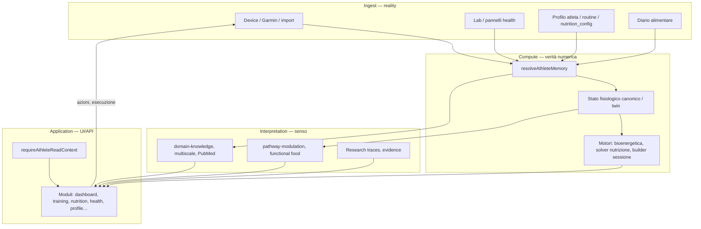
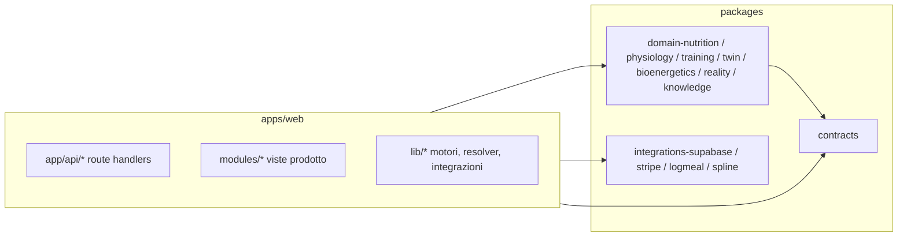
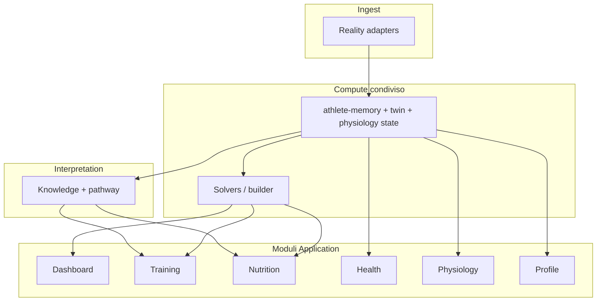

# EMPATHY — Architettura multilayer completa (mappa unica Pro 2)

**Repo:** `empathy-pro-2-cursor` · **App:** `apps/web` (Next.js) · **Monorepo:** `packages/*`, `tooling/*`.

Questo file è l’**indice organizzativo** (“cosa c’è, dove sta, come parla con cosa”). Non sostituisce i documenti normativi: li incrocia. **Ingresso dedicato al “sistema generativo” Pro 2 (4 piani + dove approfondire):** `docs/EMPATHY_PRO2_GENERATIVE_SYSTEM_ARCHITECTURE.md`. Aggiornare questo file quando si aggiungono moduli, gate lettura o pipeline deterministiche.

| Fonte | Ruolo |
|--------|--------|
| `CONSTITUTION.md` | Invarianti prodotto e tecnici |
| `docs/ARCHITECTURE.md` | Piani dati e confini monorepo |
| `docs/EMPATHY_PRO2_GENERATIVE_SYSTEM_ARCHITECTURE.md` | Ingresso “sistema generativo” Pro 2 (4 piani) + puntatore a questa mappa |
| `docs/EMPATHY_PRO2_DATA_AND_GENERATION_NETWORK.md` | Rete A/B, nutrizione, gap noti |
| `docs/EMPATHY_OPERATIONAL_REALIZATION_MAP.md` | Spina lettura, hub, fasi |
| `docs/EMPATHY_MULTISCALE_BIOLOGICAL_ENGINE.md` | Multiscala / domain-knowledge |
| `docs/EMPATHY_LAYER8_SYSTEMIC_MODULATION.md` | Modulazione sistemica (L8) |
| `docs/PRO2_UI_PAGE_CANON.md` | Canone UI |
| `docs/PLATFORM_AND_DEPLOY.md` | Vercel / Git |

---

## 1. Due modi di nominare gli stessi strati (non confonderli)

Nel materiale EMPATHY compaiono **due tassonomie**; servono a granularità diverse.

### A) Quattro **piani generativi** (flusso dati end-to-end)

Usati in `docs/ARCHITECTURE.md`, `docs/EMPATHY_PRO2_DATA_AND_GENERATION_NETWORK.md`, regole Cursor `empathy_generative_core.mdc`.

| Piano | Contenuto | Output tipico |
|--------|-------------|-----------------|
| **Ingest** | Device, lab, profilo, import, diario, eventi normalizzati | Record DB, file, envelope qualità |
| **Compute** | Motori deterministici, twin, solver (nutrizione, bioenergetica, session builder) | Numeri canonici, contratti strutturati |
| **Interpretation** | Knowledge, pathway, trace, PubMed, staging L2 | Testo evidenza, binding, modulazione **senza** riscrivere i numeri |
| **Application** | UI, API thin, export, coach, billing | Schermate, azioni utente |

### B) Livelli **L1–L4** (mappa operativa / “spina”)

Usati in `docs/EMPATHY_OPERATIONAL_REALIZATION_MAP.md` per audit e copertura codice.

| Livello | Nome operativo | Collegamento ai 4 piani |
|---------|----------------|---------------------------|
| **L4** | Data | Ingest + storage (Supabase, cache) |
| **L3** | Physiology / motori | Compute (nucleo numerico) |
| **L2** | Interpretazione (AI nel senso EMPATHY) | Interpretation |
| **L1** | Application | Application |

**Regola pratica:** quando qualcuno dice “L3” intende **motori + twin**; “Interpretation” è il **sopramotore** narrativo/evidenziale. Non sono due stack diversi: sono **viste** dello stesso impianto.

---

## 2. Organigramma logico (loop chiuso + 4 piani)

**Invarianti** (da `CONSTITUTION.md`): `Reality > Plan`, `Physiology > UI`, **carico interno > esterno** dove definito; **un solo** generatore canonico di **singola sessione** (builder-equivalente); calendario = **operativo**; AI **non** sostituisce motori per numeri canonici.

---

## 3. Monorepo — dove vive cosa

| Cartella | Responsabilità |
|----------|------------------|
| `apps/web/app` | Route Next (App Router), `api/*` |
| `apps/web/modules` | UI per modulo (training, nutrition, health, …) |
| `apps/web/lib` | Auth gate, memory, nutrition solvers, training builder, dashboard bundle |
| `apps/web/api` | Contratti TypeScript payload client |
| `packages/contracts` | Tipi condivisi |
| `packages/domain-*` | Logica dominio **senza** React |
| `packages/integrations-*` | Adattatori esterni |
| `supabase/migrations` | Schema canonico DB |

---

## 4. Matrice “piano × artefatto” (file e interazioni chiave)

### 4.1 Ingest + gate Application

| Funzione | File / entrypoint |
|----------|-------------------|
| Policy lettura atleta | `apps/web/lib/auth/athlete-read-context.ts` (`requireAthleteReadContext`) |
| Aggregato memoria | `apps/web/lib/memory/athlete-memory-resolver.ts` → `GET /api/athlete-memory` |
| Copertura spina (QA) | `apps/web/lib/platform/read-spine-coverage.ts` |
| Hub dashboard | `apps/web/app/api/dashboard/athlete-hub/route.ts` |

### 4.2 Compute — training / calendario

| Funzione | File / entrypoint |
|----------|-------------------|
| Finestra pianificato + eseguito | `GET /api/training/planned-window` → `apps/web/lib/training/planned-executed-window-query.ts` |
| Inserimento sessione (builder → DB) | `POST /api/training/planned/insert` |
| Motore generazione sessione | `POST /api/training/engine/generate` |
| Import esecuzioni | `POST /api/training/import`, esecuzioni `…/executed` |
| Contesto VIRYA / analytics | `…/virya-context`, `…/analytics` (bundle operativo riusato) |

### 4.3 Compute — nutrizione (esempio tracciato end-to-end)

| Passo | File |
|--------|------|
| Contesto modulo (profilo, planned, segnali) | `GET /api/nutrition/module` → `apps/web/app/api/nutrition/module/route.ts` — dopo `resolveAthleteMemory`, merge antropometria (`birth_date`, `sex`, `height_cm`, `weight_kg`, `body_fat_pct`, `muscle_mass_kg`) da `athlete_profiles` via **`db`** read spine + `lib/nutrition/nutrition-module-profile-merge.ts` |
| Bundle operativo (twin, loop, **nutritionPerformanceIntegration**) | `apps/web/lib/dashboard/resolve-operational-signals-bundle.ts` |
| Modello energetico giorno | `apps/web/lib/nutrition/daily-energy-solver.ts` (`computeNutritionDailyEnergyModel`) |
| UI griglia pasti / % | `apps/web/modules/nutrition/views/NutritionPageView.tsx` (`mealRows`, `caloricSplit`) |
| Request deterministico | `apps/web/lib/nutrition/intelligent-meal-plan-request-builder.ts` |
| Assemblaggio piano (no LLM) | `POST /api/nutrition/intelligent-meal-plan` → `deterministic-meal-plan-from-request.ts` → `mediterranean-meal-composer.ts` |
| Composizione canonica alimenti | `canonical-food-composition.ts`, `meal-exposition-helpers.ts` |
| Card pasti | `NutritionMealPlanView.tsx`, `EmpathyMealPlanExpositionCard.tsx` |

### 4.4 Interpretation

| Funzione | File / entrypoint |
|----------|-------------------|
| Pathway nutrizione (testo / template) | `apps/web/lib/nutrition/pathway-modulation-model.ts` |
| Multiscala | `packages/domain-knowledge/…`, `GET /api/knowledge/multiscale-bottleneck` |
| PubMed / trace | `app/api/knowledge/pubmed/*`, store trace in `lib/knowledge/*` |
| Staging L2 (anti fork memoria) | `docs/PRO2_APPLICATION_READ_SPINE_AND_INTERPRETATION_STAGING.md`, `lib/memory/interpretation-staging-contract.ts` |

### 4.5 Application (moduli UI)

| Modulo | Route app tipiche | Note |
|--------|-------------------|------|
| Dashboard | `/`, `/dashboard` | Hub `athlete-hub` |
| Training | `/training/*` | `planned-window`, builder, calendar |
| Nutrition | `/nutrition/*` | Module, meal plan, diary, fueling |
| Health | `/health` | Pannelli, upload |
| Physiology | `/physiology` | Profile, history, snapshot |
| Profile | `/profile` | `GET /api/profile`, `profile/athlete-row` |
| Athletes (coach) | `/athletes` | Roster, invites |

---

## 5. Indice API (raggruppato per dominio)

**Training:** `planned-window`, `planned`, `planned/insert`, `import`, `import-planned`, `executed`, `engine/generate`, `virya-context`, `analytics`, `builder/*`.

**Nutrition:** `module`, `intelligent-meal-plan`, `diary`, `diary/micronutrients`, `food-lookup`, `food-photo-estimate`, `catalog`, `usda-by-nutrient`, `profile-config`, `media`, `device-export`, `athlete-summary`, `nutrition` (radice se presente).

**Health:** `health`, `health/panels-latest`, `health/panels-timeline`, `health/upload-document`.

**Physiology:** `physiology`, `physiology/profile`, `physiology/history`, `physiology/snapshot`, `physiology/profile-latest` (compat / deprecato per audit).

**Memoria / piattaforma:** `athlete-memory`, `dashboard/athlete-hub`, `access/ensure-profile`, `profile`, `profile/athlete-row`, `settings/integration-flags`.

**Knowledge:** `knowledge/pubmed`, `knowledge/multiscale-bottleneck`, …

**Integrazioni:** `integrations/garmin/*`, `integrations/status`.

**Billing:** `billing/checkout-session`, `billing/checkout-config`, `webhooks/stripe`.

Percorsi completi: sotto `apps/web/app/api/`.

---

## 6. Funzioni “a occhio” — checklist cosa deve esistere

Usare questa lista per vedere **cosa manca** senza rileggere tutto il codice.

- [ ] **Gate unico** su ogni lettura sensibile: `requireAthleteReadContext`.
- [ ] **Memoria**: `resolveAthleteMemory` coerente con profilo DB + snapshot (niente pesi “fantasma”).
- [ ] **Calendario**: una coppia tabelle / API finestra (`planned-window`) come verità operativa.
- [ ] **Builder**: un solo flusso materializza sessione; note contratto builder sulle righe ove previsto.
- [ ] **Nutrition solver**: `daily-energy-solver` + leve `buildNutritionPerformanceIntegration` allineate a modulo e hub.
- [ ] **Piano pasti**: assemblaggio **solo** deterministico (`intelligent-meal-plan`); AI fuori dal percorso numerico pasto.
- [ ] **Interpretation**: pathway / knowledge **non** sovrascrivono macro pasto senza pipeline esplicita.
- [ ] **L8 / sistemico** (se abilitato): migration + doc `EMPATHY_LAYER8_SYSTEMIC_MODULATION.md` + lettura in memoria dove previsto.

---

## 7. Diagramma sintetico “4 piani × moduli prodotto”

---

## 8. Manutenzione di questo documento

1. Aggiungere una riga in §4 o §5 quando nasce una **nuova route** o un **nuovo package** dominio.
2. Aggiornare §6 quando si chiude un gap architetturale (spunta la casella).
3. Se cambiano i **4 piani** o la **spina lettura**, aggiornare prima `ARCHITECTURE.md` / `EMPATHY_OPERATIONAL_REALIZATION_MAP.md`, poi **sincronizzare** qui il riassunto (questo file non duplica paragrafi lunghi: punta ai sorgenti).

---

*Creato come mappa unica multilayer EMPATHY Pro 2 — aprile 2026.*
