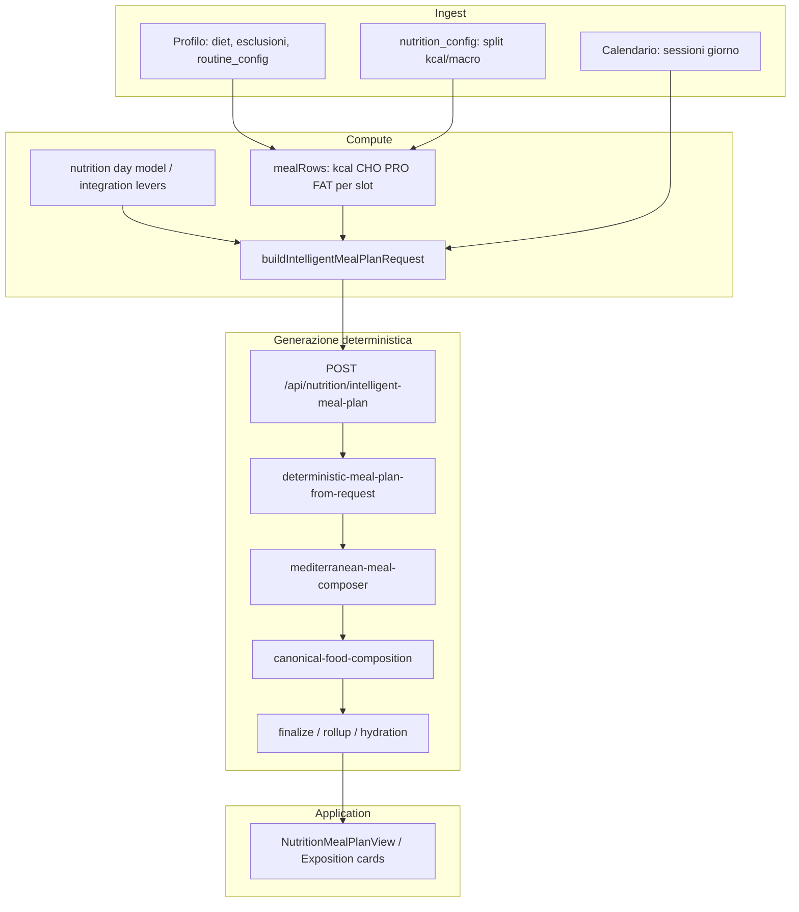
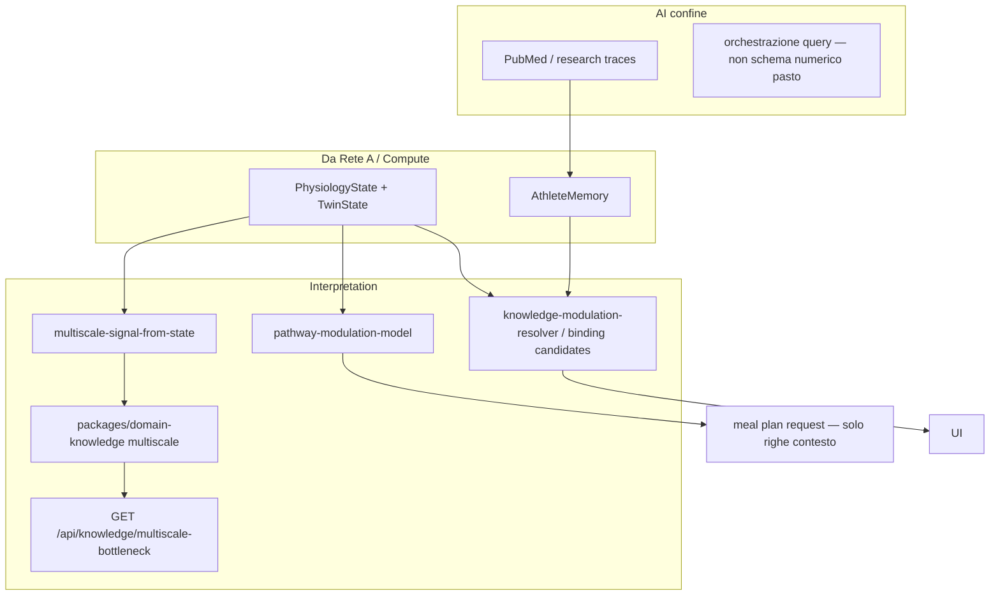

# Empathy Pro 2 — Rete dati, generazione deterministica e dialogo AI

**Repo:** `empathy-pro-2-cursor` · **Status:** mappa concettuale + gap (aprile 2026).  
**Allineamento:** `CONSTITUTION.md`, `docs/ARCHITECTURE.md`, regole generative (4 piani), `docs/EMPATHY_MULTISCALE_BIOLOGICAL_ENGINE.md`.

---

## 1. Ordine costituzionale: cosa è “generato” e da chi

| Piano | Ruolo | Cosa produce | Chi / dove (Pro 2) |
|-------|--------|----------------|---------------------|
| **Ingest** | Reality | Eventi, file, profilo, calendario, pannelli salute | Import training, profilo, diario, biomarkers |
| **Compute** | Verità numerica | Fabbisogni, macro slot, twin, motori fisiologia | Solver nutrizione, `profile-resolver`, motori lab, twin state |
| **Interpretation** | Senso senza riscrivere i numeri | Pathway, trace, binding candidati, bottleneck multiscala, testo evidenza | `pathway-modulation-model`, knowledge resolvers, `@empathy/domain-knowledge` multiscala, API PubMed/knowledge |
| **Application** | Presentazione e azioni | UI, export, coach controls | Pagine modulo, card piano pasti, pannelli |

**Generazione “forte” (struttura + numeri canonici):** solo **Compute** + pipeline deterministiche che consumano input strutturati (es. meal plan deterministico, builder sessione).  
**AI / LLM:** nel canone attuale **non** genera il piano pasto; resta confinata a interpretazione, ricerca, etichettatura — salvo policy esplicita futura.

---

## 2. Rete A — Informazione deterministica e pipeline “generata”

Flusso principale **Nutrition → meal plan** (esempio già implementato):

**File pivot (dialogano in sequenza o per tipo dato):**

| Area | File / modulo | Legge | Scrive / espone |
|------|----------------|-------|-----------------|
| Profilo → pasti | `NutritionPageView.tsx` | `profile`, `routine_config.meal_times`, calendario giorno | `mealRows`, `intelligentMealPlanRequest` |
| Request API | `intelligent-meal-plan-request-builder.ts` | profile, mealRows, pathway, `trainingDayLines`, `routineDigest` (parziale) | `IntelligentMealPlanRequest` |
| Pathway testuale | `meal-plan-pathway-timing-lines.ts`, `pathway-modulation-model.ts` | twin/physiology-like, sessioni | righe timing nel request |
| API route | `app/api/nutrition/intelligent-meal-plan/route.ts` | body request | JSON piano + `solverBasis` |
| Assembler | `deterministic-meal-plan-from-request.ts` | request | slot + items |
| Porzioni | `mediterranean-meal-composer.ts` | macro slot | items + `approxKcal` grezze |
| Canonico | `canonical-food-composition.ts`, `meal-exposition-helpers.ts` | nome, hint, ml/g | macro esposte, sync kcal |
| Memoria atleta | `lib/memory/athlete-memory-resolver.ts` | Supabase aggregato | `AthleteMemory` per altri moduli |
| Fisiologia | `lib/physiology/profile-resolver.ts` | DB lab | `CanonicalPhysiologyState` |

**Lacune note nella Rete A (routine vs calendario):**

- `routine_config.week_plan` (orari per giorno + training disegnato) **non** alimenta ancora in modo completo `mealTimes` per la data selezionata né il composer (solo `meal_times` flat + testo `routineDigest` ridotto).
- **Post-workout / timing pasto vs fine sessione:** nessun segnale strutturato verso `mediterranean-meal-composer` — serve regola deterministica aggiuntiva (vedi §5).

---

## 3. Rete B — Interpretazione e dialogo AI (sopra la Rete A)

Questa rete **legge** output di Compute e memoria; **non** sostituisce solver/builder.

| Componente | Package / path | Input tipico | Output | Tocca numeri pasto? |
|------------|----------------|--------------|--------|---------------------|
| Pathway nutrizione | `pathway-modulation-model.ts` | physiology + twin | `NutritionPathwayModulationViewModel` | No (solo template) |
| Multiscala | `domain-knowledge` + `multiscale-bottleneck` route | snapshot proxy | `MetabolicBottleneckView` | No |
| Knowledge training | `virya-context` route, research flow | memory + physiology | piani trace | No |
| AI ricerca | API knowledge | query | evidenza | No |

---

## 3.1 Loop operativo dinamico (twin → adattamento → nutrizione / fueling)

Questo è il pezzo “**legge tutto e modula**” allineato a **V1 `GET /api/dashboard`**: stessa catena deterministica, fattorizzata in **`lib/dashboard/resolve-operational-signals-bundle.ts`** e usata da:

- **`GET /api/nutrition/module`** — contesto completo modulo (già prima; ora delega al bundle per evitare drift).
- **`GET /api/dashboard/athlete-hub?includeOperationalSignals=1`** — hub leggero + **stesso** payload di segnali (twin guidance, loop rigenerazione, modulazione bioenergetica, dial `nutritionPerformanceIntegration`).

**Catena (nessun LLM sui numeri):**

1. **Memoria** `AthleteMemory` (`resolveAthleteMemory`) — twin, fisiologia, diario, profilo.
2. **`buildAdaptationGuidance`** — atteso vs osservato (twin), semaforo, range riduzione.
3. **`buildTrainingDayOperationalContext`** — recovery + traffic light → modalità giornata.
4. **`resolveAdaptationRegenerationLoop`** — carico pianificato vs eseguito, `divergenceScore`, `status` (`aligned` / `watch` / `regenerate`), **`nextAction`** (`keep_course` / `retune_next_sessions` / `regenerate_microcycle`). È il gancio “dinamico” verso il piano: la **rigenerazione automatica del microciclo** resta un passo applicativo esplicito (azione utente/coach o job), non un side-effect nascosto dell’API hub.
5. **`buildBioenergeticModulation`** — ponte physiology + twin + recovery.
6. **`extractDiaryAdaptiveSignals`** — realtà alimentare nella finestra.
7. **`buildNutritionPerformanceIntegration`** — dial su energia training, CHO fueling, proteine, idratazione + `rationale[]`.

**Dove entrano microbiota, intolleranze, integratori (oggi):**

| Segnale | Dove vive in memoria / profilo | Effetto tipico |
|--------|---------------------------------|----------------|
| **Microbiota / gut** | Health memory, proxy in pathway | `pathway-modulation-model` e tag narrativi (es. delivery CHO / redox); non un motore separato “microbiota → grammi”. |
| **Intolleranze / esclusioni** | `athlete_profiles` → meal request | Filtri su catalogo / `filterIntelligentMealPlanRequestFoods` e vincoli solver. |
| **Integratori** | `supplements`, `supplement_config` | Modulazione fueling / priorità narrative; dial aggregati tramite profilo + pathway dove già cablato. |

**Parità V1:** in V1 il bundle è inline in `GET /api/dashboard`; in Pro 2 l’equivalente numerico è **condiviso** col modulo Nutrition e opzionale sull’hub (`includeOperationalSignals=1`) per non appesantire ogni client che non serve.

---

## 4. Matrice: chi può “fruttare” i dati oggi vs matematica aggiuntiva

| Flusso / modulo | Legge già bene | Usa bene in Compute | Solo testo / parziale | Serve estensione deterministica |
|-----------------|----------------|----------------------|------------------------|--------------------------------|
| Macro pasto da profilo + solver | Sì (`mealRows`) | Sì | — | Affinare con `week_plan` per data |
| Timing pasti | `meal_times` | Sì in slot | `week_plan` ignorato | Parser giorno → `scheduledTimeLocal` |
| Allenamento vs pasto | Sessioni calendario | `trainingDayLines` | Non incrocia orari routine | **Grafo tempo:** fine sessione vs pranzo/cena |
| CHO post-workout | — | — | — | **Regole composer** (flag `postTrainingLunch`) |
| Twin / lab → pathway | Sì | — | Modulation | Opzionale: pesi su template |
| Multiscala bottleneck | Sì | — | Interpretazione UI | Opzionale: hint su priorità copy |
| AI PubMed | Abstract/evidenza | — | Sì | Guardrail: non riscrivere macro |

**“Matematica aggiuntiva”** qui significa: funzioni pure (timestamp, finestre, soglie) che **decidono varianti di template** o **parametri** passati al composer/solver — non LLM.

---

## 5. Priorità coerenti con l’architettura

1. **Routine → request:** per `planDate`, risolvere orari da `week_plan[weekday]` con fallback a `meal_times`; estendere `summarizeRoutine` con stringhe auditabili (senza cambiare twin).
2. **Training timing:** da sessioni calendario (start/end o durata + default) + orario pasto slot → booleani `mealFollowsTrainingWithin(slot, minutes)`.
3. **Composer:** ramo deterministico (es. preferire amido rapido / ridurre legumi massivi a pranzo se `lunch` post-workout).
4. **Multiscala / AI:** restano sopra la Rete A; possono arricchire disclaimer e priorità narrative, non sostituire il passo 1–3.

---

## 6. Riferimenti incrociati

- Riallineamento operativo: `docs/CURSOR_REALIGN_DAILY.md`, `docs/CURSOR_REALIGN_DEEP.md`
- Multiscala (blueprint + implementazione seed): `docs/EMPATHY_MULTISCALE_BIOLOGICAL_ENGINE.md`, `packages/domain-knowledge/src/multiscale/`
- Canone UI: `docs/PRO2_UI_PAGE_CANON.md`

**Fine.**
