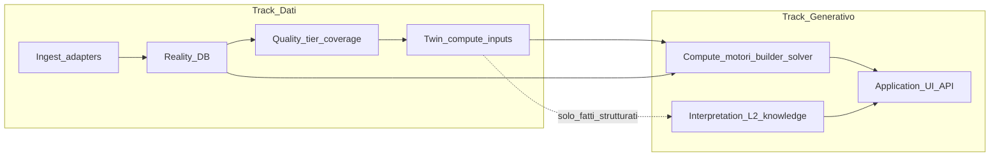

# Pro 2 — Piano ottimizzazione dati e sistemi generativi

**Repo:** `empathy-pro-2-cursor` · **Aggiornamento:** maggio 2026  
**Report stato:** [`docs/ATHLETE_GREENFIELD_AND_SYSTEM_STATUS_REPORT.md`](ATHLETE_GREENFIELD_AND_SYSTEM_STATUS_REPORT.md)

Due binari **accoppiati ma distinti**:

1. **Track D (Dati)** — Ingest → reality DB → qualità/tier → input twin e motori.
2. **Track G (Generativo)** — Compute deterministico (builder, solver, load-series) + Interpretation (L2, knowledge) senza contaminare numeri canonici.

**Regola:** Track D alimenta Track G. Vietate pipeline parallele (`.cursor/rules/empathy_pro2_no_parallel_lines.mdc`, `empathy_ingest_envelope.mdc`).

---

## Architettura

---

## Track D — Ottimizzazione dati

| Fase | Obiettivo | File / aree chiave |
|------|-----------|-------------------|
| **D0** | Diagnostica piano/reale | `planned-executed-window-query`, `garmin-activity-materialize`, analytics route |
| **D1** | Reality training end-to-end | Garmin/Wahoo/Strava → `executed_workouts` + TSS; runbook prima settimana |
| **D2** | RHR in recovery | `sleep-recovery-signals.ts`, `recovery-summary.ts` |
| **D3** | Tier + confidence in hub | `twin-context-strip-from-memory`, `athlete-hub` |
| **D4** | Health/lab → Core | `health-document-pipeline` |
| **D5** | Osservabilità admin | rollups (solo con migration survey) |
| **D6** | Multi-vendor senza doppioni | `data-source-preference.ts`, `ingest-stream-policy`, Settings |
| **D7** | Sensori futuri (Aura, Apple, SmO2, lattato, sudore) | contracts + migration canale + `lib/integrations/*` |

**Exit Track D:** atleta demo soddisfa DoD report; Core con CTL/coupling significativi dopo 7g con esecuzione; un percorso training (Garmin **o** Wahoo **o** Strava) + un recovery (WHOOP **o** Garmin) documentato.

---

## Track G — Ottimizzazione generativo

| Fase | Obiettivo | File / aree chiave |
|------|-----------|-------------------|
| **G0** | Reality > Plan in UI | `DashboardLoadAnalysisSummary`, `adaptation-regeneration-loop` |
| **G1** | Motori unici | `domain-training`, `load-series`; science doc §5 |
| **G2** | Memory-first nei moduli | operational map Fase 1 |
| **G3** | Nutrition routine ↔ solver | `routine-week-plan-meal-times`, meal composer |
| **G4** | Interpretation L2 | staging, generative-core tests |
| **G5** | Hub trasversale | `PRO2_CROSS_LAYER_CONTEXT_HUB_AND_ENRICHMENT.md` |
| **G6** | Gate generativo su copertura ingest | builder, cross-channel, bioenergetics day |
| **G7** | AI sensor-aware (provenance) | no LLM su ctl/adaptation |

**Exit Track G:** memory → builder → calendar → executed testato; smoke con/senza esecuzione e multi-device policy.

---

## Sequenza (8–10 settimane)

| Settimane | Focus |
|---------|--------|
| 1–2 | D0, D2, G0, G1 (parallelo) |
| 3–4 | D1 Garmin/executed (blocca CTL); Strava pull UI |
| 4–5 | D6 policy + preferenze dominio |
| 5–6 | D3, G2, G6 |
| 7–9 | D7 sensori futuri |
| 7+ | G3, G4, G7 (dopo D1) |

---

## Ordine PR suggerito

1. **Docs** — report + questo piano + link ARCHITECTURE.
2. **G0** — banner Core + gate loop (`lowExecutionEvidence`).
3. **D2** — RHR in filtro `resolveLatestRecoverySummary`.
4. **D1** — fix executed/TSS (scope da D0).
5. **D3/G2** — tier/confidence hub.

---

## Criteri di successo globali

| Metrica | Target |
|---------|--------|
| DoD atleta demo | 100% criteri settimana 1 |
| Core a eseguito=0 | Banner + loop attenuato |
| `npm run verify` | Verde dopo ogni milestone |
| Vendor | Nessun doppio TSS con policy + preferenza |

## Fuori scope

- Motore sessione parallelo al builder.
- Parità numerica vendor.
- Restyle UI massivo.
- `vercel deploy --prod` da agente.
