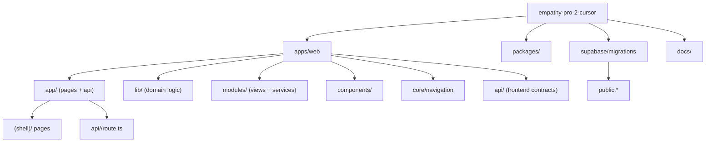

# EMPATHY Pro 2 Repository Map

Scope: `empathy-pro-2-cursor` only (Pro 2.0).  
Out of scope: V1 (`nextjs-empathy-pro`), refactor, migration changes, file deletions.

This document is the structural baseline to clean safely without breaking behavior.

## Conventions

- Each entry uses a repository-relative path in backticks.
- Flags:
  - `hot`: high-risk/high-impact path
  - `legacy`: likely historical or transitional path
  - `candidate`: candidate for cleanup, not deletion by default
- Database ownership matrix is grouped by domain and references migration + primary readers/writers.

## Coverage Diagram

---

## 1) Top-Level Structure

- `apps/web`: Next.js Pro 2 app (UI + APIs + orchestration).
- `packages`: shared contracts/domain packages consumed by `apps/web`.
- `supabase`: migrations + SQL operational scripts.
- `tooling`: custom tooling (`eslint-rules-empathy`).
- `scripts`: repository-level automation scripts.
- `docs`: architecture/runbook/operational documents.

### `apps/web` summary (TS/TSX)

- `app`: 165 files (`125 ts`, `40 tsx`)
- `lib`: 337 files (`336 ts`, `1 tsx`)
- `modules`: 44 files (`24 ts`, `20 tsx`)
- `components`: 111 files (`3 ts`, `108 tsx`)
- `core`: 10 files (`10 ts`)
- `api`: 5 files (`5 ts`)

### `apps/web` subfolder purpose

- `app/(shell)`: authenticated product pages by module.
- `app/api`: HTTP route handlers (`route.ts`) for product and integrations.
- `app/access`, `app/auth`, `app/invite`, `app/privacy`, `app/pricing`: public/auth support surfaces.
- `lib/auth`: auth context, session guards, profile bootstrap.
- `lib/memory`: athlete memory resolver/writer.
- `lib/training`, `lib/nutrition`, `lib/physiology`: deterministic domain engines.
- `lib/integrations`: Garmin/Whoop/Wahoo/Strava OAuth + pull/push + materialization.
- `modules/*/views`: module pages and orchestration UI.
- `components/*`: reusable UI by domain.
- `core/navigation`: module registry and cross-module navigation model.
- `api/*`: frontend API contracts.

---

## 2) Module Entry Points (UI + API + Lib Hubs)

## Training

- UI pages:
  - `apps/web/app/(shell)/training/page.tsx`
  - `apps/web/app/(shell)/training/builder/page.tsx`
  - `apps/web/app/(shell)/training/calendar/page.tsx`
  - `apps/web/app/(shell)/training/analytics/page.tsx`
  - `apps/web/app/(shell)/training/session/page.tsx`
  - `apps/web/app/(shell)/training/session/[date]/page.tsx`
  - `apps/web/app/(shell)/training/vyria/page.tsx`
- Module views:
  - `apps/web/modules/training/views/TrainingHubPageView.tsx`
  - `apps/web/modules/training/views/TrainingBuilderRichPageView.tsx`
  - `apps/web/modules/training/views/TrainingCalendarPageView.tsx`
  - `apps/web/modules/training/views/TrainingAnalyticsPageView.tsx`
  - `apps/web/modules/training/views/TrainingSessionPageView.tsx`
  - `apps/web/modules/training/views/TrainingViryaPageView.tsx`
- API routes:
  - `apps/web/app/api/training/planned-window/route.ts` (`GET`)
  - `apps/web/app/api/training/planned/route.ts` (`POST`, `PATCH`, `DELETE`)
  - `apps/web/app/api/training/planned/insert/route.ts` (`POST`)
  - `apps/web/app/api/training/executed/route.ts` (`POST`, `DELETE`)
  - `apps/web/app/api/training/import/route.ts` (`POST`)
  - `apps/web/app/api/training/import-planned/route.ts` (`POST`)
  - `apps/web/app/api/training/analytics/route.ts` (`GET`)
  - `apps/web/app/api/training/session-series/route.ts` (`GET`)
  - `apps/web/app/api/training/engine/generate/route.ts` (`POST`) (`hot`)
  - `apps/web/app/api/training/expected-vs-obtained/route.ts` (`GET`, `POST`)
  - `apps/web/app/api/training/virya-context/route.ts` (`GET`)
  - `apps/web/app/api/training/backfill-series/route.ts` (`POST`)
- Lib hubs:
  - `apps/web/lib/training/planned-executed-window-query.ts` (`hot`)
  - `apps/web/lib/training/adaptation-regeneration-loop.ts`
  - `apps/web/lib/training/expected-vs-obtained-engine.ts`
  - `apps/web/lib/training/virya-retune-proposal.ts`
  - `apps/web/lib/training/training-planned-import-service.ts` (`hot`)

## Nutrition

- UI pages:
  - `apps/web/app/(shell)/nutrition/page.tsx`
  - `apps/web/app/(shell)/nutrition/meal-plan/page.tsx`
  - `apps/web/app/(shell)/nutrition/diary/page.tsx`
  - `apps/web/app/(shell)/nutrition/fueling/page.tsx`
  - `apps/web/app/(shell)/nutrition/predictor/page.tsx`
  - `apps/web/app/(shell)/nutrition/integration/page.tsx`
- Module views:
  - `apps/web/modules/nutrition/views/NutritionPageView.tsx`
  - `apps/web/modules/nutrition/views/NutritionMealPlanView.tsx`
- API routes:
  - `apps/web/app/api/nutrition/route.ts`
  - `apps/web/app/api/nutrition/module/route.ts`
  - `apps/web/app/api/nutrition/athlete-summary/route.ts`
  - `apps/web/app/api/nutrition/profile-config/route.ts`
  - `apps/web/app/api/nutrition/adherence-config/route.ts`
  - `apps/web/app/api/nutrition/diary/route.ts`
  - `apps/web/app/api/nutrition/diary/micronutrients/route.ts`
  - `apps/web/app/api/nutrition/intelligent-meal-plan/route.ts`
  - `apps/web/app/api/nutrition/catalog/route.ts`
  - `apps/web/app/api/nutrition/food-lookup/route.ts`
  - `apps/web/app/api/nutrition/fdc-foods/[fdcId]/route.ts`
  - `apps/web/app/api/nutrition/usda-by-nutrient/route.ts`
- Lib hubs:
  - `apps/web/lib/nutrition/daily-energy-solver.ts`
  - `apps/web/lib/nutrition/deterministic-meal-plan-from-request.ts`
  - `apps/web/lib/nutrition/meal-plan-solver-basis.ts`
  - `apps/web/lib/nutrition/pathway-modulation-model.ts`

## Physiology

- UI pages:
  - `apps/web/app/(shell)/physiology/page.tsx`
  - `apps/web/app/(shell)/physiology/daily/page.tsx`
  - `apps/web/app/(shell)/physiology/daily/[date]/page.tsx`
  - `apps/web/app/(shell)/physiology/bioenergetics/page.tsx`
- Module views:
  - `apps/web/modules/physiology/views/PhysiologyPageView.tsx`
  - `apps/web/modules/physiology/views/PhysiologyDailyWellnessPageView.tsx`
  - `apps/web/modules/physiology/views/BioenergeticTransparencyHubPageView.tsx`
- API routes:
  - `apps/web/app/api/physiology/route.ts`
  - `apps/web/app/api/physiology/daily-panel/route.ts`
  - `apps/web/app/api/physiology/history/route.ts`
  - `apps/web/app/api/physiology/snapshot/route.ts`
  - `apps/web/app/api/physiology/profile/route.ts`
  - `apps/web/app/api/physiology/profile-latest/route.ts`
  - `apps/web/app/api/physiology/multisport-energy/route.ts`
  - `apps/web/app/api/physiology/multisport-cp-curve/route.ts`
  - `apps/web/app/api/physiology/multisport-snapshot/route.ts`
  - `apps/web/app/api/physiology/vo2max-lab/route.ts`
- Lib hubs:
  - `apps/web/lib/physiology/daily-wellness-panel.ts`
  - `apps/web/lib/physiology/wellness-window-summary.ts`
  - `apps/web/lib/physiology/profile-resolver.ts`
  - `apps/web/lib/physiology/lactate-steady-state-curve.ts`

## Profile

- UI pages:
  - `apps/web/app/(shell)/profile/page.tsx`
- Module views:
  - `apps/web/modules/profile/views/ProfilePageView.tsx`
- API routes:
  - `apps/web/app/api/profile/route.ts`
  - `apps/web/app/api/profile/athlete-row/route.ts`
- Lib hubs:
  - `apps/web/lib/profile/coerce-profile-view-model.ts`
  - `apps/web/lib/profile/map-athlete-profile-row.ts`

## Dashboard

- UI pages: none in `app/(shell)/dashboard/*`.
- API routes:
  - `apps/web/app/api/dashboard/athlete-hub/route.ts`
  - `apps/web/app/api/dashboard/reasoning/route.ts`
- Lib hubs:
  - `apps/web/lib/dashboard/resolve-operational-signals-bundle.ts`
  - `apps/web/lib/dashboard/use-athlete-operational-hub.ts`

## Integrations

- UI pages: none dedicated under `app/(shell)/integrations/*`; entrypoint from Profile/Training.
- API routes:
  - Garmin: `apps/web/app/api/integrations/garmin/*` (`authorize`, `callback`, `link-status`, `disconnect`, `backfill`, `pull/cron`, `pull/run`, `push`, `wellness-snapshot`)
  - Whoop: `apps/web/app/api/integrations/whoop/*`
  - Wahoo: `apps/web/app/api/integrations/wahoo/*`
  - Strava: `apps/web/app/api/integrations/strava/*`
- Lib hubs:
  - `apps/web/lib/integrations/garmin-*.ts` (`hot`)
  - `apps/web/lib/integrations/whoop-*.ts`
  - `apps/web/lib/integrations/wahoo-*.ts`
  - `apps/web/lib/integrations/strava-*.ts`
  - `apps/web/lib/integrations/vendor-oauth-*.ts`

## Health / Lab

- UI pages:
  - `apps/web/app/(shell)/health/page.tsx`
  - `apps/web/app/(shell)/health/staging/[id]/page.tsx`
- Module views:
  - `apps/web/modules/health/views/HealthPageView.tsx`
  - `apps/web/modules/health/views/HealthStagingReviewView.tsx`
- API routes:
  - `apps/web/app/api/health/route.ts`
  - `apps/web/app/api/health/upload-document/route.ts`
  - `apps/web/app/api/health/panels-latest/route.ts`
  - `apps/web/app/api/health/panels-timeline/route.ts`
  - `apps/web/app/api/health/panels/reanalyze-bulk/route.ts`
  - `apps/web/app/api/health/panels/[id]/analyze-with-ai/route.ts`
  - `apps/web/app/api/health/staging-runs/[id]/route.ts`
  - `apps/web/app/api/health/staging-runs/[id]/apply/route.ts`
- Lib hubs:
  - `apps/web/lib/health/health-document-pipeline.ts`
  - `apps/web/lib/health/parse-health-pdf.ts`
  - `apps/web/lib/health/health-observation-normalizer.ts`
  - `apps/web/lib/health/health-causal-interactions.ts`

## Knowledge

- UI pages: none dedicated.
- API routes:
  - `apps/web/app/api/knowledge/pubmed/route.ts`
  - `apps/web/app/api/knowledge/europepmc/route.ts`
  - `apps/web/app/api/knowledge/ensembl/search/route.ts`
  - `apps/web/app/api/knowledge/ncbi-gene/search/route.ts`
  - `apps/web/app/api/knowledge/gene-ontology/search/route.ts`
  - `apps/web/app/api/knowledge/reactome/search/route.ts`
  - `apps/web/app/api/knowledge/uniprot/search/route.ts`
  - `apps/web/app/api/knowledge/rhea/search/route.ts`
  - `apps/web/app/api/knowledge/chebi/search/route.ts`
  - `apps/web/app/api/knowledge/chembl/molecules/search/route.ts`
  - `apps/web/app/api/knowledge/corpus/import/route.ts`
  - `apps/web/app/api/knowledge/research-traces/route.ts`
- Lib hubs:
  - `apps/web/lib/knowledge/research-planner.ts`
  - `apps/web/lib/knowledge/knowledge-research-flow.ts`
  - `apps/web/lib/knowledge/knowledge-corpus-importer.ts`

## Admin

- UI pages:
  - `apps/web/app/(shell)/admin/page.tsx`
- Module views:
  - `apps/web/modules/admin/views/AdminConsoleView.tsx`
- API routes:
  - `apps/web/app/api/admin/me/route.ts`
  - `apps/web/app/api/admin/coaches/route.ts`
  - `apps/web/app/api/admin/coaches/[userId]/route.ts`

## Access/Auth

- UI pages: public entries under `app/access`, `app/auth/*`.
- API routes:
  - `apps/web/app/api/access/ensure-profile/route.ts` (`hot`)
  - `apps/web/app/api/auth/session/route.ts`
- Lib hubs:
  - `apps/web/lib/auth/request-auth.ts` (`legacy`)
  - `apps/web/lib/auth/athlete-read-context.ts` (`hot`)
  - `apps/web/lib/auth/bootstrap-app-user-profile.ts` (`hot`)

---

## 3) Hot Zones (Detailed)

## 3.1 Identity Athlete Resolution (`hot`)

- `apps/web/lib/use-active-athlete.tsx`
  - Client source of active athlete; reads session + `app_user_profiles`.
  - Risk: stale local storage and re-bootstrap ordering.
- `apps/web/app/api/access/ensure-profile/route.ts`
  - Server bootstrap for user profile + athlete linkage.
  - Must remain canonical for user->athlete mapping.
- `apps/web/lib/auth/bootstrap-app-user-profile.ts`
  - Core resolver and upsert logic.
  - Shared helper `athleteIdByNormalizedEmail` should be the only email-based canonical resolver.
- `apps/web/lib/memory/athlete-memory-domain-writer.ts`
  - Profile upsert path; must reuse canonical resolver.
- `apps/web/lib/athletes/canonical-profile.ts`
  - Client-side dedupe helper by email; informative, not DB dedupe.

## 3.2 Training Calendar Read Path (`hot`)

- `apps/web/modules/training/views/TrainingCalendarPageView.tsx`
  - Builds date window and calls `GET /api/training/planned-window`.
  - Aggregates by date with `plannedByDate` and `executedByDate`.
- `apps/web/app/api/training/planned-window/route.ts`
  - Authoritative API for calendar read model.
  - Reads planned + executed by `athlete_id`, `from`, `to`.
- `apps/web/lib/training/planned-executed-window-query.ts`
  - Shared select/filter for `planned_workouts` and `executed_workouts`.
- Related write paths that affect visibility:
  - `apps/web/app/api/training/import/route.ts`
  - `apps/web/lib/training/training-planned-import-service.ts`
  - `apps/web/app/api/training/planned/route.ts`
  - `apps/web/app/api/training/planned/insert/route.ts`

## 3.3 Garmin Integration Surface (`hot`)

- API:
  - `apps/web/app/api/integrations/garmin/authorize/route.ts`
  - `apps/web/app/api/integrations/garmin/callback/route.ts`
  - `apps/web/app/api/integrations/garmin/push/[[...segments]]/route.ts`
  - `apps/web/app/api/integrations/garmin/pull/cron/route.ts`
  - `apps/web/app/api/integrations/garmin/pull/run/route.ts`
  - `apps/web/app/api/integrations/garmin/backfill/route.ts`
- Lib:
  - `apps/web/lib/integrations/garmin-pull-runner.ts`
  - `apps/web/lib/integrations/garmin-push-persist.ts`
  - `apps/web/lib/integrations/garmin-activity-materialize.ts`
  - `apps/web/lib/integrations/garmin-wellness-backfill.ts`
  - `apps/web/lib/integrations/garmin-oauth2-api.ts`

---

## 4) Database Ownership Matrix (DB -> Migration -> Code)

## Identity

- `athlete_profiles`
  - migration: `supabase/migrations/001_pro2_v1_canonical_prereq_read_spine.sql`
  - writers: `apps/web/lib/auth/bootstrap-app-user-profile.ts`, `apps/web/lib/memory/athlete-memory-domain-writer.ts`
  - readers: `apps/web/lib/memory/athlete-memory-resolver.ts`, `apps/web/lib/use-active-athlete.tsx`
  - purpose: canonical athlete identity/profile.

- `app_user_profiles`
  - migration: `supabase/migrations/001_pro2_v1_canonical_prereq_read_spine.sql`
  - writers: `apps/web/lib/auth/bootstrap-app-user-profile.ts`, `apps/web/lib/use-active-athlete.tsx`
  - readers: `apps/web/lib/use-active-athlete.tsx`, `apps/web/lib/memory/athlete-memory-resolver.ts`
  - purpose: user-role-athlete mapping.

- `coach_athletes`
  - migration: `supabase/migrations/001_pro2_v1_canonical_prereq_read_spine.sql`
  - writers: `apps/web/lib/auth/bootstrap-app-user-profile.ts`, `apps/web/app/api/invites/accept/route.ts`
  - readers: `apps/web/lib/use-active-athlete.tsx`
  - purpose: coach-athlete tenancy.

## Training

- `planned_workouts`
  - migration: `supabase/migrations/014_training_planned_executed_import_jobs_v1.sql`
  - writers: `apps/web/app/api/training/planned/route.ts`, `apps/web/app/api/training/planned/insert/route.ts`, `apps/web/lib/training/training-planned-import-service.ts`
  - readers: `apps/web/lib/training/planned-executed-window-query.ts`, `apps/web/lib/twin/athlete-state-resolver.ts`
  - purpose: planned session calendar.

- `executed_workouts`
  - migration: `supabase/migrations/014_training_planned_executed_import_jobs_v1.sql`
  - writers: `apps/web/app/api/training/import/route.ts`, `apps/web/app/api/training/executed/route.ts`, `apps/web/lib/integrations/garmin-activity-materialize.ts`, `apps/web/lib/integrations/strava-pull-runner.ts`, `apps/web/lib/integrations/wahoo-pull-runner.ts`, `apps/web/lib/integrations/whoop-pull-runner.ts`
  - readers: `apps/web/lib/training/planned-executed-window-query.ts`, `apps/web/app/api/profile/route.ts`, `apps/web/lib/twin/athlete-state-resolver.ts`
  - purpose: canonical executed training log.

- `training_import_jobs`
  - migration: `supabase/migrations/014_training_planned_executed_import_jobs_v1.sql`
  - writers/readers: `apps/web/app/api/training/import/route.ts`, `apps/web/lib/training/training-planned-import-service.ts`
  - purpose: import lifecycle tracking.

- `executed_workout_series`
  - migration: `supabase/migrations/045_executed_workout_series_v1.sql`
  - writers: `apps/web/lib/training/import-series-persist.ts`
  - readers: analyzer/training detail surfaces via training queries (`candidate` to map deeper)
  - purpose: high-density per-channel series.

## Nutrition

- `nutrition_constraints`
  - migration: `supabase/migrations/027_v1_nutrition_plan_compat.sql`
  - writers: `apps/web/app/api/nutrition/adherence-config/route.ts`
  - readers: `apps/web/app/api/nutrition/athlete-summary/route.ts`, `apps/web/lib/memory/athlete-memory-resolver.ts`
  - purpose: nutrition constraints/preferences.

- `food_diary_entries`
  - migration: `supabase/migrations/016_nutrition_catalog_and_food_diary_v1.sql`
  - writers/readers: `apps/web/app/api/nutrition/diary/route.ts`
  - purpose: meal diary records.

- `nutrition_product_catalog`
  - migration: `supabase/migrations/016_nutrition_catalog_and_food_diary_v1.sql`
  - writers/readers: `apps/web/app/api/nutrition/catalog/route.ts`
  - purpose: product catalog.

## Physiology / Health

- `physiological_profiles`
  - migration: `supabase/migrations/001_pro2_v1_canonical_prereq_read_spine.sql`
  - writers: `apps/web/app/api/physiology/vo2max-lab/route.ts`
  - readers: `apps/web/lib/memory/athlete-memory-resolver.ts`
  - purpose: physiology baseline states.

- `biomarker_panels`
  - migration: `supabase/migrations/001_pro2_v1_canonical_prereq_read_spine.sql`
  - writers: `apps/web/app/api/health/upload-document/route.ts`, `apps/web/lib/memory/athlete-memory-domain-writer.ts`
  - readers: health timelines and profile resolvers.
  - purpose: lab/biomarker panel storage.

- `metabolic_lab_runs`
  - migration: `supabase/migrations/015_read_spine_metabolic_and_evidence_v1.sql`
  - writers: `apps/web/app/api/physiology/snapshot/route.ts`, `apps/web/app/api/physiology/vo2max-lab/route.ts`
  - readers: physiology history/profile routes.
  - purpose: metabolic test snapshots.

## Knowledge / Research

- `knowledge_documents`, `knowledge_entities`, `knowledge_assertions`, `athlete_knowledge_bindings`
  - migration: `supabase/migrations/018_knowledge_library_and_research_traces_v1.sql`
  - writers/readers: sparse in app layer (`candidate`, `unused-in-code` check required before cleanup)
  - purpose: structured knowledge graph and athlete linkage.

- `knowledge_evidence_hits`
  - migration: `supabase/migrations/015_read_spine_metabolic_and_evidence_v1.sql`
  - writers: `apps/web/lib/memory/athlete-memory-domain-writer.ts`
  - readers: `apps/web/lib/memory/athlete-memory-resolver.ts`
  - purpose: evidence hits persisted for interpretation context.

## Integrations

- `vendor_oauth_links`
  - migration: `supabase/migrations/037_vendor_oauth_links.sql`
  - writers: `apps/web/lib/integrations/vendor-oauth-persist.ts`
  - readers: `apps/web/lib/integrations/vendor-oauth-read.ts`
  - purpose: vendor OAuth token and link state.

- `garmin_push_receipts`, `garmin_pull_jobs`, `garmin_athlete_links`
  - migration: `supabase/migrations/006_garmin_push_receipts.sql`, `007_garmin_pull_jobs.sql`, `008_garmin_athlete_links.sql`
  - writers/readers: `apps/web/app/api/integrations/garmin/*`, `apps/web/lib/integrations/garmin-*.ts`
  - purpose: Garmin notification/pull/link pipeline.

- `device_sync_exports`
  - migration: `supabase/migrations/001_pro2_v1_canonical_prereq_read_spine.sql`
  - writers/readers: integration pull runners and status endpoints
  - purpose: device sync export tracking.

## Generic / Control

- `manual_actions`
  - migration: `supabase/migrations/017_manual_actions_and_athlete_update_locks_v1.sql`
  - writers/readers: `apps/web/app/api/manual-actions/route.ts`, `apps/web/app/api/manual-actions/[id]/route.ts`
  - purpose: controlled manual operational patches.

- `athlete_update_locks`
  - migration: `supabase/migrations/017_manual_actions_and_athlete_update_locks_v1.sql`
  - writers/readers: manual-actions apply paths
  - purpose: lock row for conflict-safe updates.

---

## 5) Packages Map

- `packages/contracts` (`@empathy/contracts`)
  - role: canonical shared types/schemas.
  - consumers: `apps/web` routes, module contracts, domain adapters.

- `packages/domain-training` (`@empathy/domain-training`)
  - role: training domain model and mappers.
  - consumers: `apps/web/app/api/training/*`, `apps/web/modules/training/*`.

- `packages/domain-nutrition` (`@empathy/domain-nutrition`)
  - role: nutrition domain model and calculations.
  - consumers: `apps/web/app/api/nutrition/*`, nutrition components.

- `packages/domain-physiology` (`@empathy/domain-physiology`)
  - role: physiology domain primitives.
  - consumers: `apps/web/app/api/physiology/*`, physiology module.

- Additional domain/integration packages:
  - `packages/domain-knowledge`
  - `packages/domain-reality`
  - `packages/domain-bioenergetics`
  - `packages/domain-twin`
  - `packages/integrations-*`
  - status: active usage varies by module; treat as dependency graph roots before cleanup.

---

## 6) Candidate Dead/Legacy Areas

- `/training/virya` alias handled in `apps/web/next.config.mjs` redirects (`legacy compat`)
- `apps/web/modules/training/services/training-write-api.ts` reduced to active export only (`replaceTrainingPlannerCalendar`)
- Tables with little/no direct app ownership in matrix (`candidate`, verify before any migration cleanup)
- `apps/web/lib/auth/request-auth.ts` (`legacy`) vs `apps/web/lib/auth/athlete-read-context.ts` (`canonical`)

---

## 7) Quick Diagnostic Index

## Calendar session not visible

Read path:

1. `apps/web/lib/use-active-athlete.tsx` resolves `activeAthleteId`
2. `apps/web/modules/training/views/TrainingCalendarPageView.tsx` calls:
   - `GET /api/training/planned-window?athleteId=...&from=...&to=...`
3. `apps/web/app/api/training/planned-window/route.ts` + `apps/web/lib/training/planned-executed-window-query.ts` read:
   - `planned_workouts`
   - `executed_workouts`
4. Calendar renders executed from `executed_workouts.date` grouped by day.

## Duplicate athlete same email

Identity path to inspect:

1. `apps/web/app/api/access/ensure-profile/route.ts`
2. `apps/web/lib/auth/bootstrap-app-user-profile.ts`
3. `apps/web/lib/memory/athlete-memory-domain-writer.ts`
4. `supabase/migrations/009_athlete_profiles_email_normalized_unique.sql`
5. `supabase/migrations/010_athlete_profiles_email_normalized_unique_index.sql`

Rule: enforce canonical mapping through `app_user_profiles.athlete_id`; email dedupe helpers are support only.

---

## 8) Migration Catalog (000-047)

- `supabase/migrations/000_pro2_orgs.sql` — org primitives
- `supabase/migrations/001_pro2_v1_canonical_prereq_read_spine.sql` — canonical read spine and core tables
- `supabase/migrations/002_coach_athletes_org_multitenant.sql` — coach multitenancy
- `supabase/migrations/003_coach_invitations.sql` — invitation model
- `supabase/migrations/004_health_uploads_bucket.sql` — health uploads bucket
- `supabase/migrations/005_device_sync_exports_provider_ecosystem.sql` — device export ecosystem
- `supabase/migrations/006_garmin_push_receipts.sql` — Garmin push receipts
- `supabase/migrations/007_garmin_pull_jobs.sql` — Garmin pull jobs
- `supabase/migrations/008_garmin_athlete_links.sql` — Garmin athlete links
- `supabase/migrations/009_athlete_profiles_email_normalized_unique.sql` — normalized email function
- `supabase/migrations/010_athlete_profiles_email_normalized_unique_index.sql` — normalized email unique index
- `supabase/migrations/011_systemic_modulation_snapshots.sql` — modulation snapshots
- `supabase/migrations/012_garmin_oauth2_refresh_pull_fallback.sql` — Garmin OAuth2 pull fallback
- `supabase/migrations/013_garmin_athlete_links_user_permissions.sql` — Garmin permissions
- `supabase/migrations/014_training_planned_executed_import_jobs_v1.sql` — planned/executed/import jobs
- `supabase/migrations/015_read_spine_metabolic_and_evidence_v1.sql` — metabolic + evidence spine
- `supabase/migrations/016_nutrition_catalog_and_food_diary_v1.sql` — nutrition catalog + diary
- `supabase/migrations/017_manual_actions_and_athlete_update_locks_v1.sql` — manual actions + locks
- `supabase/migrations/018_knowledge_library_and_research_traces_v1.sql` — knowledge library
- `supabase/migrations/019_billing_stripe_v1.sql` — Stripe billing model
- `supabase/migrations/020_biomech_session_imports_and_capture_jobs_v1.sql` — biomech import jobs
- `supabase/migrations/021_biomech_capture_storage_bucket_v1.sql` — biomech bucket
- `supabase/migrations/022_metabolic_lab_vo2max_section_v1.sql` — VO2max section
- `supabase/migrations/023_biomarker_panels_rls_v1.sql` — biomarker RLS
- `supabase/migrations/024_platform_coach_status_and_admin.sql` — coach/admin status
- `supabase/migrations/025_nutrition_fdc_food_cache.sql` — FDC cache
- `supabase/migrations/026_v1_remaining_core_state_tables.sql` — remaining v1 core state
- `supabase/migrations/027_v1_nutrition_plan_compat.sql` — nutrition compat
- `supabase/migrations/028_media_assets_catalog_v1.sql` — media catalog
- `supabase/migrations/029_training_and_lab_rls_hardening.sql` — RLS hardening
- `supabase/migrations/030_interpretation_staging.sql` — interpretation staging
- `supabase/migrations/031_device_ecosystem_parity.sql` — device parity
- `supabase/migrations/032_physiology_health_multilayer_bridge.sql` — physiology-health bridge
- `supabase/migrations/033_health_omics_causal_graph.sql` — omics causal graph
- `supabase/migrations/034_training_expected_obtained_adaptation.sql` — expected vs obtained
- `supabase/migrations/035_athlete_coach_application_traces.sql` — application traces
- `supabase/migrations/036_nutrition_fdc_metabolic_indices.sql` — nutrition metabolic indices
- `supabase/migrations/037_vendor_oauth_links.sql` — vendor oauth links
- `supabase/migrations/038_nutrition_metabolic_indices_repair.sql` — repair migration
- `supabase/migrations/039_athlete_device_ingest_policy.sql` — ingest policy
- `supabase/migrations/040_vendor_oauth_strava.sql` — Strava oauth extension
- `supabase/migrations/041_knowledge_entities_source_chembl.sql` — ChEMBL source
- `supabase/migrations/042_knowledge_entities_source_rhea.sql` — Rhea source
- `supabase/migrations/043_demo_seed_contact_jan_apr.sql` — demo seed
- `supabase/migrations/044_demo_nutrition_micros.sql` — demo micros
- `supabase/migrations/045_executed_workout_series_v1.sql` — executed series
- `supabase/migrations/046_garmin_activity_blob_storage.sql` — Garmin blob storage
- `supabase/migrations/047_nutrition_adherence_opt_in.sql` — adherence opt-in

---

## 9) End-to-End Runtime Chains (Operational)

This section maps the main runtime chains with the Pro 2 principle:
Ingest -> Compute (engines + twin) -> Interpretation (structured evidence) -> Application.

## 9.1 Athlete Identity Bootstrap Chain (`hot`)

1. Session/auth context:
   - `apps/web/lib/auth/request-auth.ts` (legacy entry)
   - `apps/web/lib/auth/athlete-read-context.ts` (canonical read context)
2. Profile bootstrap:
   - `apps/web/app/api/access/ensure-profile/route.ts`
   - `apps/web/lib/auth/bootstrap-app-user-profile.ts`
3. Client athlete activation:
   - `apps/web/lib/use-active-athlete.tsx`
4. Memory/profile write side:
   - `apps/web/lib/memory/athlete-memory-domain-writer.ts`
5. Primary DB ownership:
   - `app_user_profiles.athlete_id`
   - `athlete_profiles.id`

Risk markers:

- Email-based canonicalization must remain fallback-only, never replacing `app_user_profiles.athlete_id` as source of truth.
- Any parallel bootstrap path creating athlete IDs outside this chain is candidate duplicate source.

## 9.2 Training Calendar Visibility Chain (`hot`)

1. UI request:
   - `apps/web/modules/training/views/TrainingCalendarPageView.tsx`
2. Read API:
   - `apps/web/app/api/training/planned-window/route.ts`
3. Query layer:
   - `apps/web/lib/training/planned-executed-window-query.ts`
4. Read tables:
   - `planned_workouts`
   - `executed_workouts`
5. Primary write APIs affecting visibility:
   - `apps/web/app/api/training/planned/route.ts`
   - `apps/web/app/api/training/planned/insert/route.ts`
   - `apps/web/app/api/training/import/route.ts`
   - `apps/web/app/api/training/executed/route.ts`
6. Integration writers affecting visibility:
   - `apps/web/lib/integrations/garmin-activity-materialize.ts`
   - `apps/web/lib/integrations/strava-pull-runner.ts`
   - `apps/web/lib/integrations/wahoo-pull-runner.ts`
   - `apps/web/lib/integrations/whoop-pull-runner.ts`

Risk markers:

- `athlete_id` mismatch between write path and `use-active-athlete`.
- Date normalization/timezone shift writing into adjacent day.
- Planned/executed combined view can hide issues if one stream is missing.

## 9.3 Garmin Chain (OAuth2 + Push/Pull + Materialization) (`hot`)

1. OAuth2 link:
   - `apps/web/app/api/integrations/garmin/authorize/route.ts`
   - `apps/web/app/api/integrations/garmin/callback/route.ts`
2. Link/token persistence:
   - `apps/web/lib/integrations/vendor-oauth-persist.ts`
   - `apps/web/lib/integrations/garmin-oauth2-api.ts`
3. Push ingress:
   - `apps/web/app/api/integrations/garmin/push/[[...segments]]/route.ts`
   - `apps/web/lib/integrations/garmin-push-persist.ts`
4. Pull orchestration:
   - `apps/web/app/api/integrations/garmin/pull/cron/route.ts`
   - `apps/web/app/api/integrations/garmin/pull/run/route.ts`
   - `apps/web/lib/integrations/garmin-pull-runner.ts`
5. Backfill and permissions:
   - `apps/web/app/api/integrations/garmin/backfill/route.ts`
   - `apps/web/lib/integrations/garmin-wellness-backfill.ts`
   - `apps/web/lib/integrations/garmin-admin-webhooks.ts`
6. Materialization to product tables:
   - `apps/web/lib/integrations/garmin-activity-materialize.ts` -> `executed_workouts`

Risk markers:

- Pull token invalidation (`InvalidPullTokenException`) and 412 backfill constraints.
- Out-of-sync `garmin_athlete_links.user_permissions` affecting downstream scopes.
- Cross-athlete writes if Garmin user mapping is stale.

---

## 10) Candidate Cleanup Backlog (No Code Changes Here)

All items are analysis-only backlog; no removals in this phase.

## Wave A - Canonical Identity First

- Enforce one canonical read path for athlete context:
  - target: `apps/web/lib/auth/athlete-read-context.ts` + `app_user_profiles.athlete_id`
  - reduce direct/parallel reads from ad-hoc profile lookups.
- Catalog all writers touching `athlete_profiles` and `app_user_profiles` and mark:
  - canonical
  - compatibility
  - candidate duplicate source.
- Add explicit "do-not-canonicalize-in-client" note near `use-active-athlete`.

Exit criteria:

- Every athlete-facing API receives the same athlete ID for same logged-in user after reload.

## Wave B - Training Read/Write Simplification

- Keep one canonical calendar read API:
  - `apps/web/app/api/training/planned-window/route.ts`.
- Normalize all executed workout writes through shared mapper boundary.
- Build a strict writer inventory:
  - direct writes
  - integration writes
  - import writes.

Exit criteria:

- Imported sessions visible in calendar and analyzer with same athlete/date key.

## Wave C - Integrations Surface Reduction

- For Garmin/Whoop/Wahoo/Strava, align to common primitives:
  - link status
  - pull job state
  - materialization contract.
- Eliminate vendor-specific duplicated resolver code where shared helper exists.
- Keep push ingestion idempotent and auditable by receipt/job IDs.

Exit criteria:

- Same failure model and diagnostics across all device integrations.

## Wave D - Legacy Candidates Review

- Validate real usage for:
  - `apps/web/modules/training/services/training-write-api.ts` exports
  - `apps/web/lib/auth/request-auth.ts`.
- Confirm redirects and aliases still required:
  - `apps/web/next.config.mjs` entries for `/training/virya*`.
- Validate `unused-in-code` DB tables against scripts/cron/edge use before any migration action.

Exit criteria:

- Candidate list split into:
  - remove
  - merge
  - keep (documented reason).

---

## 11) Fast Triage Checklist (When "it disappears")

Use this order to avoid chasing dead branches.

1. Confirm active athlete:
   - `app_user_profiles.athlete_id` for current auth user.
2. Confirm write target:
   - row exists in `executed_workouts` with same `athlete_id`.
3. Confirm read API window:
   - `from`/`to` includes session date.
4. Confirm date normalization:
   - UTC/local conversion does not move day bucket.
5. Confirm aggregation/render:
   - `TrainingCalendarPageView` groups same key as API payload.
6. For Garmin-origin workout:
   - trace `garmin_push_receipts` -> `garmin_pull_jobs` -> materialization row in `executed_workouts`.

If any step diverges by athlete/date key, fix key ownership before UI patching.

---

## 12) Wave A Identity Inventory (Canonical vs Duplicate Risk)

Scope of this inventory:

- identity tables: `app_user_profiles`, `athlete_profiles`, `coach_athletes`
- code zones: `apps/web/app/api/*`, `apps/web/lib/*`, selected UI readers
- objective: classify each path as:
  - `canonical`: intended source of truth or primary access path
  - `compat`: valid secondary/consumer path
  - `candidate-duplicate-risk`: path that can introduce or mask divergence if overused

## 12.1 `app_user_profiles`

### Writers

- `apps/web/lib/auth/bootstrap-app-user-profile.ts` (`canonical`)
  - upsert/ownership bootstrap for user -> athlete mapping.
- `apps/web/app/api/admin/coaches/[userId]/route.ts` (`compat`)
  - admin status update path, not athlete canonicalization.
- `apps/web/app/api/invites/accept/route.ts` (`compat`)
  - invite acceptance flow updates role/link attributes.

### Readers

- `apps/web/lib/auth/athlete-read-context.ts` (`canonical`)
  - should be central read abstraction for athlete-aware APIs.
- `apps/web/lib/use-active-athlete.tsx` (`canonical`)
  - client active-athlete anchor (must mirror server context).
- `apps/web/app/api/access/ensure-profile/route.ts` (`canonical`)
  - bootstrap guard.
- `apps/web/lib/auth/request-auth.ts` (`compat-wrapper`, `legacy`)
  - now wraps `athlete-read-context` / `training-route-auth` to preserve backward-compatible function names.
- `apps/web/lib/memory/athlete-memory-resolver.ts` (`compat`)
- `apps/web/app/api/athletes/roster/route.ts` (`compat`)
- `apps/web/app/api/admin/coaches/route.ts` (`compat`)
- `apps/web/lib/auth/require-platform-admin.ts` (`compat`)
- `apps/web/lib/athlete/can-access-athlete-data.ts` (`compat`)
- `apps/web/app/api/coach/invites/route.ts` (`compat`)

## 12.2 `athlete_profiles`

### Writers

- `apps/web/lib/auth/bootstrap-app-user-profile.ts` (`canonical`)
  - creates/resolves canonical athlete row during bootstrap.
- `apps/web/lib/memory/athlete-memory-domain-writer.ts` (`compat`, `candidate-duplicate-risk`)
  - profile domain upsert path; safe only if constrained to canonical resolver.

### Readers

- `apps/web/lib/memory/athlete-memory-resolver.ts` (`compat`)
- `apps/web/lib/use-active-athlete.tsx` (`compat`, no client canonicalization side effects)
- `apps/web/app/api/profile/athlete-row/route.ts` (`compat`)
- `apps/web/app/api/dashboard/athlete-hub/route.ts` (`compat`)
- `apps/web/app/api/physiology/daily-panel/route.ts` (`compat`)
- `apps/web/app/api/physiology/history/route.ts` (`compat`)
- `apps/web/lib/physiology/profile-resolver.ts` (`compat`)
- `apps/web/lib/profile/athlete-profile-strip.ts` (`compat`)

## 12.3 `coach_athletes`

### Writers

- `apps/web/lib/auth/bootstrap-app-user-profile.ts` (`canonical`)
  - baseline link bootstrap for coach role users.
- `apps/web/app/api/invites/accept/route.ts` (`canonical`)
  - invitation acceptance path creating/upserting coach-athlete links.

### Readers

- `apps/web/lib/auth/athlete-read-context.ts` (`canonical`)
- `apps/web/lib/use-active-athlete.tsx` (`compat`)
- `apps/web/app/api/athletes/roster/route.ts` (`compat`)
- `apps/web/lib/athlete/can-access-athlete-data.ts` (`compat`)

## 12.4 High-Risk Overlap to Remove (Analysis Backlog)

These are not removals yet; they are the first targets for deterministic unification.

1. Auth read overlap (completed at route-import level):
   - API routes migrated to `athlete-read-context`.
   - `request-auth.ts` kept as compatibility wrapper only.
   - direct imports of `training-route-auth` from app routes removed.
2. Profile write overlap:
   - `apps/web/lib/auth/bootstrap-app-user-profile.ts` vs `apps/web/lib/memory/athlete-memory-domain-writer.ts`
   - action: ensure all profile upserts call shared canonical athlete resolver and never fork on raw email.
3. Client/server athlete resolution split:
   - `apps/web/lib/use-active-athlete.tsx` must remain consumer of canonical mapping only.
   - action: keep client logic side-effect free for identity creation.

## 12.5 Wave A Done Criteria (Executable)

- No API route directly resolves athlete identity outside:
  - `apps/web/lib/auth/athlete-read-context.ts`
  - `apps/web/lib/auth/bootstrap-app-user-profile.ts`
- All writes to `athlete_profiles` are traceable to canonical resolver function.
- Reloading same user preserves one `athlete_id` across:
  - calendar
  - analyzer
  - profile
  - integrations materialization paths.

---

## 13) Wave B Training Inventory (Writers/Readers/Risk)

Scope of this inventory:

- tables: `planned_workouts`, `executed_workouts`, `training_import_jobs`, `executed_workout_series`
- target: isolate one canonical read model for calendar visibility and one canonical write contract per intent.

## 13.1 `planned_workouts`

### Writers

- `apps/web/app/api/training/planned/route.ts` (`canonical`)
  - CRUD + recurrence-aware operations.
- `apps/web/app/api/training/planned/insert/route.ts` (`compat`)
  - direct insert endpoint; now reuses shared canonical insert helper (`lib/training/planned/insert-planned-workout.ts`).
- `apps/web/lib/training/training-planned-import-service.ts` (`canonical` for planned-file import)

### Readers

- `apps/web/lib/training/planned-executed-window-query.ts` (`canonical` for calendar)
- `apps/web/app/api/training/planned-window/route.ts` (`canonical API wrapper`)
- `apps/web/app/api/training/analytics/route.ts` (`compat`)
- `apps/web/app/api/dashboard/athlete-hub/route.ts` (`compat`)
- `apps/web/lib/twin/athlete-state-resolver.ts` (`compat`)
- `apps/web/lib/training/expected-vs-obtained-engine.ts` (`compat`)
- `apps/web/lib/training/adaptation-regeneration-loop.ts` (`compat`)
- `apps/web/lib/internal-load/internal-load-resolver.ts` (`compat`)
- `apps/web/app/api/nutrition/route.ts` (`compat`, cross-domain coherence)

### Risk notes

- Dual insert surfaces (`planned/route.ts` and `planned/insert/route.ts`) increase ownership ambiguity.
- Planned recurrence writes can drift from calendar read window if date normalization policies diverge.

## 13.2 `executed_workouts`

### Writers

- Manual/import:
  - `apps/web/app/api/training/executed/route.ts` (`canonical manual writer`)
  - `apps/web/app/api/training/import/route.ts` (`canonical file import writer`)
  - `apps/web/lib/training/structured-import-companion-executed.ts` (`compat`, import companion)
- Integrations:
  - `apps/web/lib/integrations/garmin-activity-materialize.ts` (`canonical Garmin writer`)
  - `apps/web/lib/integrations/strava-pull-runner.ts` (`canonical Strava writer`)
  - `apps/web/lib/integrations/wahoo-pull-runner.ts` (`canonical Wahoo writer`)
  - `apps/web/lib/integrations/whoop-pull-runner.ts` (`canonical Whoop writer`)

### Readers

- `apps/web/lib/training/planned-executed-window-query.ts` (`canonical calendar reader`)
- `apps/web/app/api/training/planned-window/route.ts` (`canonical API wrapper`)
- `apps/web/app/api/training/analytics/route.ts` (`compat`)
- `apps/web/lib/training/analytics/executed-metric-aggregates.ts` (`compat`)
- `apps/web/app/api/profile/route.ts` (`compat`)
- `apps/web/app/api/dashboard/athlete-hub/route.ts` (`compat`)
- `apps/web/app/api/physiology/history/route.ts` (`compat`)
- `apps/web/lib/training/session-detail-summary.ts` (`compat`)
- `apps/web/lib/twin/athlete-state-resolver.ts` (`compat`)
- `apps/web/lib/training/adaptation-regeneration-loop.ts` (`compat`)
- `apps/web/lib/internal-load/internal-load-resolver.ts` (`compat`)

### Risk notes

- Multiple integration writers can produce same logical session with different external keys.
- Upsert strategy differs by writer (some update-if-found, some insert-first), increasing duplicate risk.
- Date bucket drift (timezone) remains top visibility failure mode.
- Strava/Wahoo/Whoop now share a canonical helper:
  - `apps/web/lib/training/executed/upsert-executed-workout.ts`

## 13.3 `training_import_jobs`

### Writers

- `apps/web/app/api/training/import/route.ts` (`canonical executed import jobs`)
- `apps/web/lib/training/training-planned-import-service.ts` (`canonical planned import jobs`)

### Readers

- `apps/web/app/api/training/import-jobs/route.ts` (`canonical status API`)
- `apps/web/lib/memory/athlete-memory-resolver.ts` (`compat`)
- `apps/web/lib/reality/ingestion-record-mapper.ts` (`compat`)

### Risk notes

- Job status transitions are split across multiple code paths; must stay idempotent for retries.

## 13.4 `executed_workout_series`

### Writers

- `apps/web/lib/training/import-series-persist.ts` (`canonical`)

### Readers

- `apps/web/app/api/training/session-series/route.ts` (`canonical`)
- `apps/web/app/api/training/backfill-series/route.ts` (`canonical maintenance`)
- `apps/web/lib/integrations/garmin-activity-materialize.ts` (`compat read/attach flow`)

### Risk notes

- Backfill and on-demand writes can overlap; requires stable conflict key and deterministic merge.

## 13.5 Wave B Done Criteria (Executable)

- One canonical calendar read chain remains:
  - `TrainingCalendarPageView` -> `planned-window/route.ts` -> `planned-executed-window-query.ts`.
- All executed writes map to a unified dedupe key policy (athlete + source + external/session identity + date).
- `training_import_jobs` status lifecycle is consistent across planned and executed import flows.
- Calendar and analyzer resolve same workout row for same athlete/date/session key.

---

## 14) Wave C Integrations Inventory (Surface Reduction)

Scope:

- Garmin, Strava, Wahoo, Whoop
- shared table: `vendor_oauth_links`
- Garmin operational tables: `garmin_athlete_links`, `garmin_pull_jobs`, `garmin_push_receipts`

## 14.1 Shared OAuth Link Surface

### Writers

- `apps/web/lib/integrations/vendor-oauth-persist.ts` (`canonical`)
  - upsert/update link and token state.

### Readers

- `apps/web/lib/integrations/vendor-oauth-read.ts` (`canonical`)
- link-status APIs:
  - `apps/web/app/api/integrations/garmin/link-status/route.ts`
  - `apps/web/app/api/integrations/strava/link-status/route.ts`
  - `apps/web/app/api/integrations/wahoo/link-status/route.ts`
  - `apps/web/app/api/integrations/whoop/link-status/route.ts`

### Risk notes

- Vendor callbacks can bypass shared helpers if custom patches are added ad hoc.

## 14.2 Garmin Operational Surface

### Writers

- OAuth/link:
  - `apps/web/app/api/integrations/garmin/callback/route.ts`
  - `apps/web/lib/integrations/garmin-access-token.ts`
- Push/pull:
  - `apps/web/lib/integrations/garmin-push-persist.ts`
  - `apps/web/lib/integrations/garmin-push-schedule-immediate-pull.ts`
  - `apps/web/lib/integrations/garmin-pull-runner.ts`
- Permissions:
  - `apps/web/lib/integrations/garmin-admin-webhooks.ts`

### Readers

- `apps/web/app/api/integrations/garmin/backfill/route.ts`
- `apps/web/app/api/integrations/garmin/wellness-snapshot/route.ts`
- `apps/web/app/api/integrations/garmin/push/[[...segments]]/route.ts`
- `apps/web/app/api/integrations/garmin/disconnect/route.ts`

### Materialization writers to product table

- `apps/web/lib/integrations/garmin-activity-materialize.ts` -> `executed_workouts`

### Risk notes

- Push->pull scheduling and direct pull-run triggers can overlap; require strict idempotency by job/receipt IDs.
- Permission sync drift can silently break specific stream availability.

## 14.3 Strava/Wahoo/Whoop Pull Writers

- `apps/web/lib/integrations/strava-pull-runner.ts`
- `apps/web/lib/integrations/wahoo-pull-runner.ts`
- `apps/web/lib/integrations/whoop-pull-runner.ts`

All three write into `executed_workouts` with provider-specific dedupe logic.

Risk notes:

- Dedupe semantics are centralized across Garmin/Strava/Wahoo/Whoop on shared helper:
  - `apps/web/lib/training/executed/upsert-executed-workout.ts`
- Same athlete activity imported from file + vendor can collide or duplicate without strong precedence policy.

## 14.4 Wave C Done Criteria (Executable)

- All vendor callback/link routes use shared oauth persist/read helpers.
- Pull runners expose consistent dedupe contract and conflict behavior.
- A single diagnostics path can trace any session:
  - vendor event -> pull job -> materialization/upsert -> `executed_workouts` row.
- Link-status semantics aligned across vendors (connected/scoped/error/reconnect-needed).

---

## 15) Wave D Legacy / Dead Candidate Validation

This section upgrades candidate list with evidence hints from code references.

## 15.1 `TrainingVyriaPlaceholderView.tsx`

- File: `apps/web/modules/training/views/TrainingVyriaPlaceholderView.tsx`
- Evidence:
  - symbol appeared only in its own file (no runtime references found).
- Status: `removed` (cleanup step completed).

## 15.2 `training-write-api.ts` export surface

- File: `apps/web/modules/training/services/training-write-api.ts`
- Evidence:
  - currently referenced by `apps/web/modules/training/components/ViryaAnnualPlanOrchestrator.tsx`.
- Status: `cleaned`: kept active export only, removed unreferenced wrappers.
- Action:
  - if new callers appear, prefer dedicated service modules instead of re-growing a generic wrapper bucket.

## 15.3 `request-auth.ts` legacy overlap

- File: `apps/web/lib/auth/request-auth.ts`
- Evidence:
  - no direct route imports remain.
  - exports preserved as compatibility wrappers to canonical auth gate.
- Status: `legacy-wrapper`.
- Action:
  - keep wrapper temporarily, then remove once all internal callers migrate to canonical symbols.

## 15.4 Alias route `training/virya`

- File removed; alias retained in `apps/web/next.config.mjs` redirect table.
- Status: `cleaned` (compat retained without duplicate app route).
- Action:
  - keep redirect until telemetry/bookmark usage is negligible, then retire alias.

## 15.5 Wave D Done Criteria (Executable)

- Each candidate tagged as one of:
  - remove-now
  - merge-then-remove
  - keep-compat (with explicit sunset trigger).
- No candidate is deleted without:
  - reference proof
  - route/navigation proof
  - fallback path confirmation.

---

## 16) Sequenced Execution Plan (Post-Analysis)

Use this order to reduce breakage risk and avoid local fixes that create new branches.

1. Wave A (Identity canonicalization)
   - freeze athlete ownership rules first.
2. Wave B (Training write/read unification)
   - unify dedupe/date policies after identity key is stable.
3. Wave C (Integrations surface reduction)
   - align vendor flows to shared contracts after training contracts are fixed.
4. Wave D (Legacy cleanup)
   - remove dead/compat code only after behavior parity is proven.

## 16.1 Cross-Wave Guardrails

- Reality > Plan:
  - every cleanup step validated against persisted DB behavior, not inferred call graph only.
- Physiology > UI:
  - no UI normalization can redefine source data semantics.
- Internal load > external load:
  - adaptation/expected-obtained paths must keep deterministic training state ownership.
- AI interpretation only:
  - no generative shortcut may create final session metrics bypassing deterministic ingest/compute layers.

## 16.2 Merge Readiness Checklist

- Identity:
  - one athlete ID per user across reload and modules.
- Training:
  - calendar/analyzer parity on executed sessions.
- Integrations:
  - traceability from vendor event to `executed_workouts`.
- Legacy:
  - each removal backed by reference proof and fallback confirmation.

