# Garmin OAuth2 test runbook

Scope: Empathy Pro 2 only (`empathy-pro-2-cursor`), production host `https://empathy-pro-2-web.vercel.app`.

## What Garmin clarified

- Request Signing in the Garmin portal is for OAuth1 only.
- Empathy Pro 2 uses OAuth2 PKCE, so Garmin data requests use `Authorization: Bearer <access_token>`.
- A few personal Garmin Connect accounts can be used for testing before production approval.
- End-user onboarding requires a production-level Garmin app.

## Required Vercel environment

Do not paste secret values in chat or commits. Verify presence and exact host/path only:

- `NEXT_PUBLIC_APP_URL=https://empathy-pro-2-web.vercel.app`
- `GARMIN_OAUTH2_CLIENT_ID`
- `GARMIN_OAUTH2_CLIENT_SECRET`
- `GARMIN_OAUTH2_REDIRECT_URI=https://empathy-pro-2-web.vercel.app/api/integrations/garmin/callback`
- `GARMIN_OAUTH_PKCE_SECRET` with at least 16 characters
- `SUPABASE_SERVICE_ROLE_KEY`
- `CRON_SECRET` and/or `GARMIN_PULL_RUN_SECRET` for pull workers
- Optional for push signature alignment: `GARMIN_PUSH_PUBLIC_BASE_URL=https://empathy-pro-2-web.vercel.app`

## Portal configuration

- OAuth2 redirect URL must exactly match `GARMIN_OAUTH2_REDIRECT_URI`.
- Push endpoints should use the same host:
  - `/api/integrations/garmin/push/deregistration`
  - `/api/integrations/garmin/push/userPermissions`
  - `/api/integrations/garmin/push/ping`
  - `/api/integrations/garmin/push/dailies`
- Keep unused summary domains on hold while validating the first flow.

## Test sequence

1. Open Pro 2 production and sign in.
2. Select/create the athlete profile that will own the Garmin link.
3. Go to Profile -> Devices -> Connect Garmin Connect.
4. Complete Garmin consent with one test Garmin Connect account.
5. On return to Profile:
   - Success: URL contains `garmin=connected`.
   - Failure: URL contains `garmin=error&reason=...`; the page also shows a short detail.
6. After success, check link status from UI: it should show a masked Garmin API ID.
7. Request a manual backfill from Profile -> Devices:
   - Start with `activityDetails`, 14 days.
   - Then try `dailies`, 14 days.
8. Let the pull worker run via cron, or run the protected pull endpoint manually with the configured bearer secret.

## Expected data path

```mermaid
flowchart LR
  Pro2Profile["Profile Devices"] --> AuthorizeRoute["/api/integrations/garmin/authorize"]
  AuthorizeRoute --> GarminConsent["Garmin OAuth2 PKCE consent"]
  GarminConsent --> CallbackRoute["/api/integrations/garmin/callback"]
  CallbackRoute --> GarminToken["Garmin token exchange"]
  GarminToken --> LinkTable["garmin_athlete_links"]
  LinkTable --> Backfill["Summary Backfill"]
  Backfill --> PushReceipt["garmin_push_receipts"]
  PushReceipt --> PullJobs["garmin_pull_jobs"]
  PullJobs --> Materialize["executed_workouts / adaptive structure"]
```

## First failure codes to inspect

- `pkce_mismatch`: browser came back after PKCE expiry, cookie missing, or different browser/session.
- `oauth2_env_missing`: missing client id, client secret, or redirect URI on Vercel.
- `service_role_unconfigured`: missing `SUPABASE_SERVICE_ROLE_KEY`.
- `Garmin token exchange HTTP ...`: Garmin rejected the callback code exchange; compare redirect URI and client credentials.
- `garmin_account_already_linked`: the same Garmin account is already linked to another athlete profile.

