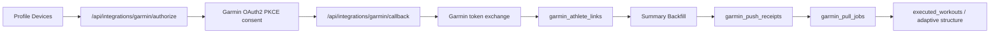

# Garmin OAuth2 test runbook

Scope: Empathy Pro 2 only (`empathy-pro-2-cursor`), production host `https://empathy-pro-2-web.vercel.app`.

## What Garmin clarified

- Request Signing in the Garmin portal is for OAuth1 only.
- Empathy Pro 2 uses OAuth2 PKCE, so Garmin data requests use `Authorization: Bearer <access_token>`.
- A few personal Garmin Connect accounts can be used for testing before production approval.
- End-user onboarding requires a production-level Garmin app.

## Required Vercel environment

Do not paste secret values in chat or commits. Verify presence and exact host/path only:

- `NEXT_PUBLIC_APP_URL=https://empathy-pro-2-web.vercel.app`
- `GARMIN_OAUTH2_CLIENT_ID`
- `GARMIN_OAUTH2_CLIENT_SECRET`
- `GARMIN_OAUTH2_REDIRECT_URI=https://empathy-pro-2-web.vercel.app/api/integrations/garmin/callback`
- `GARMIN_OAUTH_PKCE_SECRET` with at least 16 characters
- `SUPABASE_SERVICE_ROLE_KEY`
- `CRON_SECRET` and/or `GARMIN_PULL_RUN_SECRET` for pull workers
- Optional for push signature alignment: `GARMIN_PUSH_PUBLIC_BASE_URL=https://empathy-pro-2-web.vercel.app`

## Portal configuration

- OAuth2 redirect URL must exactly match `GARMIN_OAUTH2_REDIRECT_URI`.
- Push endpoints should use the same host:
  - `/api/integrations/garmin/push/deregistration`
  - `/api/integrations/garmin/push/userPermissions`
  - `/api/integrations/garmin/push/ping`
  - `/api/integrations/garmin/push/dailies`
- Keep unused summary domains on hold while validating the first flow.
- **Capability / permissions**: in the Garmin Developer portal, enable the Health API capabilities your app needs (activities, dailies, sleeps, etc.). After linking, Pro 2 Profile → Devices shows **OAuth scope** and **user permissions granted** (from Garmin `GET /rest/user/permissions`). If a stream stays empty, compare that list with the portal capability toggles — Garmin does not expose “denied” items, only what was granted.
- **State parameter**: authorize now sends `state=<athlete_uuid>` (plain UUID string, spec-aligned). Callback parser remains backward compatible with old JSON/base64 JSON state. If the user returns with `error` and no usable `state`, callback redirects to `/profile?garmin=error&reason=…&detail=callback_state_missing_athlete`.

## Test sequence

1. Open Pro 2 production and sign in.
2. Select/create the athlete profile that will own the Garmin link.
3. Go to Profile -> Devices -> Connect Garmin Connect.
4. Complete Garmin consent with one test Garmin Connect account.
5. On return to Profile:
   - Success: URL contains `garmin=connected`.
   - Failure: URL contains `garmin=error&reason=...`; the page also shows a short detail.
6. After success, check link status from UI: it should show a masked Garmin API ID.
7. Request a manual backfill from Profile -> Devices:
   - Start with `activityDetails`, 14 days.
   - Then try `dailies`, 14 days.
8. Let the pull worker run via cron, or run the protected pull endpoint manually with the configured bearer secret.

## Expected data path

```mermaid
flowchart LR
  Pro2Profile["Profile Devices"] --> AuthorizeRoute["/api/integrations/garmin/authorize"]
  AuthorizeRoute --> GarminConsent["Garmin OAuth2 PKCE consent"]
  GarminConsent --> CallbackRoute["/api/integrations/garmin/callback"]
  CallbackRoute --> GarminToken["Garmin token exchange"]
  GarminToken --> LinkTable["garmin_athlete_links"]
  LinkTable --> Backfill["Summary Backfill"]
  Backfill --> PushReceipt["garmin_push_receipts"]
  PushReceipt --> PullJobs["garmin_pull_jobs"]
  PullJobs --> Materialize["executed_workouts / adaptive structure"]
```

## First failure codes to inspect

- `access_denied`: user cancelled consent or Garmin blocked the authorization screen; retry and confirm portal capabilities.
- `pkce_mismatch`: browser came back after PKCE expiry, cookie missing, or different browser/session.
- `oauth2_env_missing`: missing client id, client secret, or redirect URI on Vercel.
- `service_role_unconfigured`: missing `SUPABASE_SERVICE_ROLE_KEY`.
- `Garmin token exchange HTTP ...` / `invalid_grant`: Garmin rejected the callback code exchange; compare redirect URI and client credentials; start a fresh authorize flow.
- `garmin_account_already_linked`: the same Garmin account is already linked to another athlete profile.
- `callback_state_missing_athlete` (in `detail`): OAuth `error` returned without a parseable `athleteId` in `state`; often a bookmarked callback URL or an interrupted flow — start again from Profile → Collega Garmin.

## Summary Backfill window and HTTP 412

- **Per-request window** depends on the stream (Garmin Health vs Activity API): Empathy clamps to about **90 days** for Health/wellness streams and about **30 days** for Activity-style streams such as **`activityDetails`** and **`moveiq`**. `GET /api/integrations/garmin/backfill` returns `maxRangeSecondsByStream` for each allowed stream name.
- **HTTP 412** on Summary Backfill (and other summary REST calls): Garmin’s Health API documents **412 Precondition Failed** when the Bearer is valid but the user has **not granted permission for that summary type** in Garmin Connect (toggle off for that data type), not only “bad date range”. Compare portal capabilities, `GET …/rest/user/permissions`, and the user’s Connect sharing settings.

## OAuth 1 → OAuth 2 migration (reference)

- Garmin’s **OAuth 2 Migration Guide** states OAuth 1 support is targeted for retirement around **2026-12-31**; contact `connect-support@developer.garmin.com` to migrate an app.
- For Ping/Pull integrations, **`callbackURL` must be honored as returned**; after migration an extra **`token`** query parameter may appear on the callback URL.
- Existing OAuth 1 user tokens can be exchanged via **`POST https://apis.garmin.com/partner-gateway/rest/user/token-exchange`** (request signed with OAuth 1 consumer credentials).

## Diagnostics and Supabase project alignment

- From the repo root, see `apps/web/scripts/garmin-diagnostic-backfill.mjs` (usage and env vars in the script header). Useful to probe `GET …/rest/backfill/<stream>` with a stored link + refresh.
- **`NEXT_PUBLIC_SUPABASE_URL`** and **`SUPABASE_SERVICE_ROLE_KEY`** must refer to the **same** Supabase project where `garmin_athlete_links` actually has rows; mismatched project keys produce “no links” while the dashboard shows data elsewhere. The script supports `GARMIN_DIAG_SUPERSEDE_ENV` to point at a specific env file (e.g. `.env.vercel.production`).

## `push/userPermissions` webhook

- With **`SUPABASE_SERVICE_ROLE_KEY`** configured on the server, a Garmin **`POST …/api/integrations/garmin/push/userPermissions`** notification updates **`garmin_athlete_links.user_permissions`** when a permission list can be parsed from the JSON, or after a **GET `/wellness-api/rest/user/permissions`** refresh using the linked athlete’s OAuth2 tokens. The push route JSON response includes **`userPermissionsSynced`** (count of rows updated).

