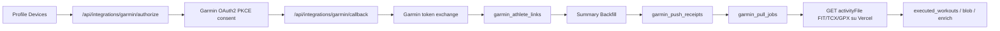

# Garmin OAuth2 test runbook

Scope: Empathy Pro 2 only (`empathy-pro-2-cursor`), production host `https://empathy-pro-2-web.vercel.app`.

## What Garmin clarified

- **Activity Details delivery (Garmin Partner Services, May 2026):** **Activity files** are only via **PING/PULL**. **Activity Details** may use **PUSH *or* PING/PULL**, but **not both at the same time** for the same integration. Pro 2: set **`GARMIN_ACTIVITY_DETAILS_VIA_PUSH=true`** on Vercel (pull runner) and use the Fly ingest default when Details are pushed to Fly — see `garmin-activity-follow-up-pull-queue.ts` and `fly.garmin-ingest.toml`.
- **Push webhooks (incl. Activity Details):** Garmin Partner Services expects the HTTP response **without long synchronous processing**; persist to your store and trigger pull/materialization **asynchronously** so the webhook does not return **HTTP 500** (timeouts / heavy JSON insert before ACK). Pro 2: `POST …/api/integrations/garmin/push/*` returns **202 Accepted** by default (`waitUntil` on Vercel); set **`GARMIN_PUSH_ACCEPTED_HTTP_STATUS=200`** only if a checker strictly requires 200. The Fly **`garmin-ingest`** server uses the same pattern (202 + background persist).
- **No-500 guarantee:** the Vercel route and the Fly ingest both wrap the pre-ack path in a top-level try/catch that **converts any unexpected exception into 202 Accepted** with a server log — body read failures, missing `SUPABASE_SERVICE_ROLE_KEY`, malformed headers, body-parser overflow, etc. all become 202 (never 500) so Partner Verification sees a healthy webhook even while we investigate the cause in logs.
- Request Signing in the Garmin portal is for OAuth1 only.
- Empathy Pro 2 uses OAuth2 PKCE, so Garmin data requests use `Authorization: Bearer <access_token>`.
- A few personal Garmin Connect accounts can be used for testing before production approval.
- End-user onboarding requires a production-level Garmin app.

## Required Vercel environment

Do not paste secret values in chat or commits. Verify presence and exact host/path only:

- `NEXT_PUBLIC_APP_URL=https://empathy-pro-2-web.vercel.app`
- `GARMIN_OAUTH2_CLIENT_ID`
- `GARMIN_OAUTH2_CLIENT_SECRET`
- `GARMIN_OAUTH2_REDIRECT_URI=https://empathy-pro-2-web.vercel.app/api/integrations/garmin/callback`
- `GARMIN_OAUTH_PKCE_SECRET` with at least 16 characters
- `SUPABASE_SERVICE_ROLE_KEY`
- `CRON_SECRET` and/or `GARMIN_PULL_RUN_SECRET` for pull workers
- **`GARMIN_ACTIVITY_DETAILS_VIA_PUSH=true`** quando i **Activity Details** arrivano via **push su Fly** (Garmin: non usare anche `GET /rest/activityDetails` dopo `activities`). Ometti o `false` solo se nel portale i Details sono **solo pull**. L’immagine Fly in `fly.garmin-ingest.toml` imposta questo default in `[env]`.
- **`GARMIN_ACTIVITY_BLOBS_BUCKET`** (consigliato in produzione): bucket Supabase per archiviare i binari `activityFile` (FIT/TCX/GPX); senza, il download può fallire o non persistere — vedi migration e `garmin-activity-blob-storage.ts`
- Optional for push signature alignment: `GARMIN_PUSH_PUBLIC_BASE_URL=https://empathy-pro-2-web.vercel.app`

## Portal configuration

- OAuth2 redirect URL must exactly match `GARMIN_OAUTH2_REDIRECT_URI`.
- Push endpoints should use the same host:
  - `/api/integrations/garmin/push/deregistration`
  - `/api/integrations/garmin/push/userPermissions`
  - `/api/integrations/garmin/push/ping`
  - `/api/integrations/garmin/push/dailies`
- Keep unused summary domains on hold while validating the first flow.
- **Capability / permissions**: in the Garmin Developer portal, enable the Health API capabilities your app needs (activities, dailies, sleeps, etc.). After linking, Pro 2 Profile → Devices shows **OAuth scope** and **user permissions granted** (from Garmin `GET /rest/user/permissions`). If a stream stays empty, compare that list with the portal capability toggles — Garmin does not expose “denied” items, only what was granted.
- **State parameter**: authorize now sends `state=<athlete_uuid>` (plain UUID string, spec-aligned). Callback parser remains backward compatible with old JSON/base64 JSON state. If the user returns with `error` and no usable `state`, callback redirects to `/profile?garmin=error&reason=…&detail=callback_state_missing_athlete`.

## Activity Details su Fly vs file FIT (pull su Vercel)

Garmin **non** mette i byte del file `.fit` nel body della push `ACTIVITY_DETAIL`. Quella push è **solo JSON** (summary + campioni dove inclusi), spesso molto grande — per questo nel portale si punta lo stream **`ACTIVITY_DETAIL`** a **`https://empathy-garmin-ingest.fly.dev/api/integrations/garmin/push/activityDetails`** (limite body alto, stessa pipeline `persistGarminPushReceipt`).

**Il FIT (o TCX/GPX) arriva sempre da una GET autenticata**, non dal webhook push:

- Endpoint Garmin: **`GET …/wellness-api/rest/activityFile`** con query tipo `id` + `token` (come restituiti da summary / callbackURL nelle notifiche).
- In Pro 2 i job sono in **`garmin_pull_jobs`** e il worker che esegue il download è sul progetto **`empathy-pro-2-web` (Vercel)** — `garmin-pull-runner`, cron `GET /api/integrations/garmin/pull/cron`, e trigger **`POST /api/integrations/garmin/pull/run`** (segreto `GARMIN_PULL_RUN_SECRET`).
- Dopo una push su **Fly**, l’ingest (se configurato) invoca proprio quel **`GARMIN_PULL_TRIGGER_URL`** su Vercel così il runner parte subito e può scaricare **`activityFile`** / altri callback accodati.

**Notifica `ACTIVITY_FILE_DATA` nel portale:** di solito l’URL è su **Vercel** (es. `…/push/activityFiles`) perché il payload è piccolo; anche lì il body **non** è il binario FIT — solo metadata che portano a mettere in coda il `GET activityFile`, sempre servito dal runner su Vercel.

In sintesi: **Fly = ingresso push JSON pesante (Activity Details) + accodamento + wake del pull Vercel**; **Vercel = esecuzione GET `activityFile` e materializzazione** (`garmin-activity-materialize`, archiviazione blob, enrich). Per verificare il FIT end-to-end dopo un’attività reale: controllare job `activityFile` completati e blob/materialize nei log Vercel / tabelle collegate, non solo la risposta HTTP 202 della push Fly.

**Partner rule (Garmin):** Activity Details = **push *or* pull**, not both. Repo default: Fly `fly.garmin-ingest.toml` sets `GARMIN_ACTIVITY_DETAILS_VIA_PUSH=true` so ingest does not enqueue `GET /rest/activityDetails` after persist; **set the same on Vercel** so `garmin-pull-runner` does not enqueue that GET after `GET /rest/activities` when Details already arrive via Fly push.

## Ora, fuso e “giorno” sessione (vs Garmin Connect)

- Nei payload **Activity** / **Wellness** Garmin, `startTimeInSeconds` è di norma **epoch Unix UTC** (secondi). In Empathy la data usata per bucketizzare la sessione (`executed_workouts.date`, ecc.) deriva da quell’istante tramite `.toISOString().slice(0, 10)` → **giorno di calendario in UTC**, non il giorno locale del dispositivo o del runner.
- Effetto pratico: una corsa **serale in Italia** può apparire su Empathy nel **giorno gregoriano successivo** rispetto a quanto mostra Connect se l’orario locale è ancora “oggi” ma in UTC è già passata la mezzanotte.
- Se in futuro servisse allineo al **giorno locale atleta**, vanno usati campi offset/TZ espliciti dal payload Garmin (nomi esatti nel **tool OpenAPI / apiDocs** autenticato: [Garmin API Docs](https://apis.garmin.com/tools/apiDocs)) — oggi non applichiamo offset aggiuntivi oltre a quanto già codificato in `startTimeGMT` / epoch.
- **Sincronizzazione ritardata:** il pull Vercel gira su **cron ogni ~5 minuti** (`vercel.json`) più eventuali `pull/run` dopo push; non è “real-time al secondo” rispetto a quando Connect mostra l’attività.

## GPX / traccia — perché può mancare e come verificare

1. **Permessi / capability:** attività con GPS richiedono permesso appropriato in Connect + capability nel portale; HTTP **412** su summary indica spesso dato disabilitato lato utente.
2. **Job `activityFile`:** in Supabase tabella **`garmin_pull_jobs`**, cerca `stream_key = 'activityFile'` (o `garmin_follow_up:activityFile`): status `failed` e messaggio errore → log Vercel sul `garmin-pull-runner`.
3. **Storage blob:** variabile **`GARMIN_ACTIVITY_BLOBS_BUCKET`** su Vercel deve puntare al bucket creato con la migration dedicata; se assente, l’archiviazione binaria fallisce (vedi log `garmin_pull_binary_archive`).
4. **Euristica follow-up (dopo GET `activities`):** finché il summary non ha **≥24** campioni in `samples` **e** **≥2** punti GPS (`latitudeInDegree` / `longitudeInDegree`), Pro 2 accoda ancora **`activityFile`** e, se non è attivo `GARMIN_ACTIVITY_DETAILS_VIA_PUSH`, anche una finestra **`activityDetails`** via GET — altrimenti molti summary “solo HR” non avviavano mai il download del file (traccia assente). Codice: `garminActivitySummaryNeedsBinaryFollowUp` in `garmin-activity-materialize.ts`, usato da `garmin-activity-follow-up-pull-queue.ts`.
5. **Formato file:** Garmin può rispondere a `activityFile` con **FIT** (tipico), **TCX** o **GPX**; il parser interno (`parseTrainingFile` / `garmin-binary-route-enrich`) normalizza in `trace_summary` per la UI — non sempre il marchio “GPX” se il vendor manda FIT.

## Documentazione Garmin ufficiale (lettura payload)

- Portale programma: [Garmin Developer / Health API](https://developer.garmin.com/gc-developer-program/health-api/) (overview prodotto).
- **Contratto OpenAPI / esempi payload:** strumento autenticato **[API Docs](https://apis.garmin.com/tools/apiDocs)** (login con Client Id + Secret dell’app) — stessa fonte citata in codice in `apps/web/lib/integrations/garmin-wellness-api.ts` (path `GET /rest/activityDetails`, `GET /rest/activityFile`, parametri `token`, `uploadStartTimeInSeconds`, ecc.).
- Mappa dati verso UI interna (letteratura): `docs/DEVICE_DATA_TO_UI_MATRIX.md` (sezione Garmin / FIT).

## Test sequence

1. Open Pro 2 production and sign in.
2. Select/create the athlete profile that will own the Garmin link.
3. Go to Profile -> Devices -> Connect Garmin Connect.
4. Complete Garmin consent with one test Garmin Connect account.
5. On return to Profile:
   - Success: URL contains `garmin=connected`.
   - Failure: URL contains `garmin=error&reason=...`; the page also shows a short detail.
6. After success, check link status from UI: it should show a masked Garmin API ID.
7. Request a manual backfill from Profile -> Devices:
   - Start with `activityDetails`, 14 days.
   - Then try `dailies`, 14 days.
8. Let the pull worker run via cron, or run the protected pull endpoint manually with the configured bearer secret.

## Expected data path

```mermaid
flowchart LR
  Pro2Profile["Profile Devices"] --> AuthorizeRoute["/api/integrations/garmin/authorize"]
  AuthorizeRoute --> GarminConsent["Garmin OAuth2 PKCE consent"]
  GarminConsent --> CallbackRoute["/api/integrations/garmin/callback"]
  CallbackRoute --> GarminToken["Garmin token exchange"]
  GarminToken --> LinkTable["garmin_athlete_links"]
  LinkTable --> Backfill["Summary Backfill"]
  Backfill --> PushReceipt["garmin_push_receipts"]
  PushReceipt --> PullJobs["garmin_pull_jobs"]
  PullJobs --> GetFile["GET activityFile FIT/TCX/GPX su Vercel"]
  GetFile --> Materialize["executed_workouts / blob / enrich"]
```

## First failure codes to inspect

- `access_denied`: user cancelled consent or Garmin blocked the authorization screen; retry and confirm portal capabilities.
- `pkce_mismatch`: browser came back after PKCE expiry, cookie missing, or different browser/session.
- `oauth2_env_missing`: missing client id, client secret, or redirect URI on Vercel.
- `service_role_unconfigured`: missing `SUPABASE_SERVICE_ROLE_KEY`.
- `Garmin token exchange HTTP ...` / `invalid_grant`: Garmin rejected the callback code exchange; compare redirect URI and client credentials; start a fresh authorize flow.
- `garmin_account_already_linked`: the same Garmin account is already linked to another athlete profile.
- `callback_state_missing_athlete` (in `detail`): OAuth `error` returned without a parseable `athleteId` in `state`; often a bookmarked callback URL or an interrupted flow — start again from Profile → Collega Garmin.

## Summary Backfill window and HTTP 412

- **Per-request window** depends on the stream (Garmin Health vs Activity API): Empathy clamps to about **90 days** for Health/wellness streams and about **30 days** for Activity-style streams such as **`activityDetails`** and **`moveiq`**. `GET /api/integrations/garmin/backfill` returns `maxRangeSecondsByStream` for each allowed stream name.
- **HTTP 412** on Summary Backfill (and other summary REST calls): Garmin’s Health API documents **412 Precondition Failed** when the Bearer is valid but the user has **not granted permission for that summary type** in Garmin Connect (toggle off for that data type), not only “bad date range”. Compare portal capabilities, `GET …/rest/user/permissions`, and the user’s Connect sharing settings.

## OAuth 1 → OAuth 2 migration (reference)

- Garmin’s **OAuth 2 Migration Guide** states OAuth 1 support is targeted for retirement around **2026-12-31**; contact `connect-support@developer.garmin.com` to migrate an app.
- For Ping/Pull integrations, **`callbackURL` must be honored as returned**; after migration an extra **`token`** query parameter may appear on the callback URL.
- Existing OAuth 1 user tokens can be exchanged via **`POST https://apis.garmin.com/partner-gateway/rest/user/token-exchange`** (request signed with OAuth 1 consumer credentials).

## Diagnostics and Supabase project alignment

- From the repo root, see `apps/web/scripts/garmin-diagnostic-backfill.mjs` (usage and env vars in the script header). Useful to probe `GET …/rest/backfill/<stream>` with a stored link + refresh.
- **`NEXT_PUBLIC_SUPABASE_URL`** and **`SUPABASE_SERVICE_ROLE_KEY`** must refer to the **same** Supabase project where `garmin_athlete_links` actually has rows; mismatched project keys produce “no links” while the dashboard shows data elsewhere. The script supports `GARMIN_DIAG_SUPERSEDE_ENV` to point at a specific env file (e.g. `.env.vercel.production`).

## `push/userPermissions` webhook

- With **`SUPABASE_SERVICE_ROLE_KEY`** configured on the server, a Garmin **`POST …/api/integrations/garmin/push/userPermissions`** notification updates **`garmin_athlete_links.user_permissions`** when a permission list can be parsed from the JSON, or after a **GET `/wellness-api/rest/user/permissions`** refresh using the linked athlete’s OAuth2 tokens. The push route JSON response includes **`userPermissionsSynced`** (count of rows updated).

