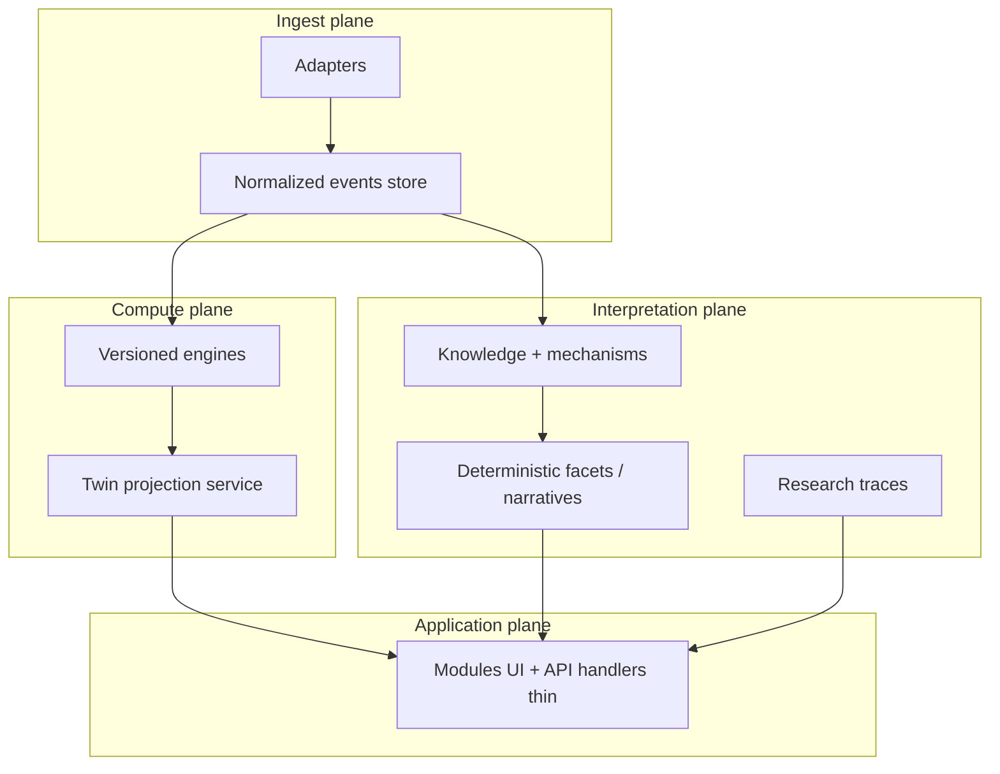

# EMPATHY Pro 2.0 — Blueprint tecnico (greenfield)

**Prodotto e charter:** `docs/PRODUCT_VISION.md`, `CONSTITUTION.md`, `docs/COMMERCIAL_AND_ROLES.md`.  
Questo file è lo **scheletro tecnico** e l’assorbimento da V1.

**Fonti V1 da non perdere:** `ARCHITECTURE_RULES.md`, `docs/ARCHITECTURE.md`, `docs/PLATFORM_STRUCTURAL_SCHEMA.md`, `docs/KNOWLEDGE_LIBRARY_ARCHITECTURE.md`, `.cursor/rules/empathy_*.mdc` (nel repo `nextjs-empathy-pro`).

---

## 1. Perché una traccia 2.0 in parallelo

- V1 accumula **debito strutturale inevitabile** (migrazioni Supabase, route cresciute organicamente, duplicazioni da chiudere nelle Wave 2–3).
- Obiettivo 2.0: **stesso modello mentale e invarianti**, ma **scheletro** (cartelle, confini package, pipeline dati, contract-first) progettato *dopo* aver visto tutto ciò che la piattaforma deve fare.
- Strategia consigliata: **strangler** — nuovi sottosistemi nascono nel blueprint / repo dedicato; V1 continua fino a cutover per dominio (es. solo knowledge, solo reality) o big-bang solo se debito critico.

---

## 2. Invarianti assoluti

Sono ora in **`CONSTITUTION.md`** (include anche principi di prodotto). Riassunto tecnico:

1. Loop: `reality → physiology → bioenergetics → twin → azioni → esecuzione → dato reale → confronto → adattamento → aggiornamento`.
2. Priorità: `Reality > Plan`, `Physiology > UI`, `Internal load > external`.
3. **Un solo** generatore canonico di singola sessione: **builder**; calendario = operativo; VIRYA = orchestrazione verso builder, non motore parallelo.
4. AI / LLM: interpretazione, evidenza, orchestrazione — **mai** sostituto dei motori deterministici o del twin come unica verità.
5. Moduli prodotto ufficiali (estensibili Fase 2 salute): dashboard, profile, physiology, training, nutrition, health, biomechanics, aerodynamics, athletes, settings.

---

## 3. Piano di assorbimento da V1 (knowledge transfer)

| Area V1 | Cosa estrarre per 2.0 | Cosa **non** copiare ciecamente |
|---------|------------------------|----------------------------------|
| **Contratti** | `api/*/contracts.ts`, `lib/empathy/schemas/*` come *specifica* | Payload route legacy incoerenti |
| **Builder** | `BuilderSessionContract`, session knowledge shape | UI builder monolitica tale quale |
| **Knowledge** | Flusso corpus → mechanisms → bindings → packet → traces | Implementazione API duplicata |
| **Reality** | Adapter pattern, envelope, quality flags | Ogni hack provider-specific non generalizzato |
| **Nutrizione** | Pathway model, functional catalog, USDA merge logic | Accoppiamenti view-specific |
| **Training** | Multilevel strip, adaptation targets engine types | Pagina-per-pagina copy |
| **Regole Cursor / team** | Contenuto `.cursor/rules/empathy_*.mdc` | Path file identici se cambia tooling |

Output atteso: un **pacchetto “domain spec”** (OpenAPI / Zod / JSON Schema) generato o sincronizzato da contratti V1 prima del primo commit applicativo.

---

## 4. Scheletro repository target (proposta)

```text
repo-root/
  CONSTITUTION.md
  docs/
    PRODUCT_VISION.md
    COMMERCIAL_AND_ROLES.md
    TECHNICAL_BLUEPRINT.md
    MIGRATION_FROM_V1.md
  packages/
    contracts/
    domain-reality/
    domain-physiology/
    domain-bioenergetics/
    domain-twin/
    domain-training/
    domain-nutrition/
    domain-knowledge/
    integrations-stripe/
    integrations-supabase/
  apps/
    web/
    api/                    # opzionale
  tooling/
    eslint-rules-empathy/
```

**Principio:** motori e contratti in **package**; app solo wiring, auth, rendering.

---

## 5. Stack a layer



---

## 6. Pack di regole (giorno 0 codice)

| File | Contenuto |
|------|-----------|
| `stability-first.mdc` | Auth, athlete/coach context, generative guard |
| `architecture-gate.mdc` | Divieto generatore sessione parallelo; obbligo lettura twin |
| `generative-core.mdc` | Reality > Plan; bioenergetica modulante |
| `secrets-env.mdc` | Mai `.env.local` in repo; solo `.env.example` |
| `testing-engines.mdc` | Ogni engine: test + golden fixtures |

---

## 7. Migrazione dati

Vedi `docs/MIGRATION_FROM_V1.md`.

---

## 8. Checklist operativa

`docs/v2/SKELETON_CHECKLIST.md`

---

*Versione blueprint tecnico: 0.2 — allineato a charter prodotto 2.0.*
