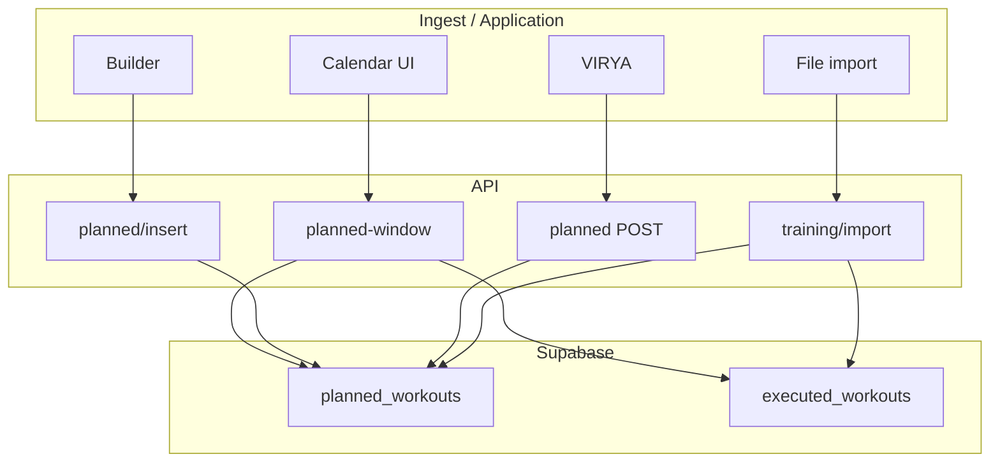

# Training Calendar — system map (Pro 2)

**Status:** operational reference · **Repo:** `empathy-pro-2-cursor`  
**Related:** [EMPATHY_PRO2_DATA_AND_GENERATION_NETWORK.md](./EMPATHY_PRO2_DATA_AND_GENERATION_NETWORK.md), [PRO2_STRUCTURED_SESSION_CANON.md](./PRO2_STRUCTURED_SESSION_CANON.md), [ATHLETE_MEMORY_AND_COACH_SCOPE.md](./ATHLETE_MEMORY_AND_COACH_SCOPE.md)

## Hub rule

- **Read spine:** `GET /api/training/planned-window` → `queryPlannedExecutedWindow` ([`planned-executed-window-query.ts`](../apps/web/lib/training/planned-executed-window-query.ts))
- **Planned writes:** Builder → `POST /api/training/planned/insert`; VIRYA batch → `POST /api/training/planned`; import → `POST /api/training/import`
- **Executed writes:** manual, device ingest, import (activity), structured companion (optional)
- **Builder domina VIRYA:** save Builder su un giorno **elimina** righe `[VIRYA:…]` quel giorno prima dell’insert (evita doppio conteggio nutrizione)

## Data flow



## Tables

### `planned_workouts` (migration `014`)

| Column | UI / engine use |
|--------|-----------------|
| `athlete_id` | Scope; RLS |
| `date` | Calendar day key |
| `type` | Chip label fallback |
| `duration_minutes` | KPI fallback |
| `tss_target`, `kj_target`, `kcal_target` | KPI fallback; nutrition |
| `notes` | **`BUILDER_SESSION_JSON::…`** = chart + steps; **`[VIRYA:Plan]`** = VIRYA provenance |

### `executed_workouts`

| Column | Use |
|--------|-----|
| `source` | `file_import:…`, device prefixes; preference filter |
| `trace_summary` | Analyzer telemetry |
| `planned_workout_id` | Link to PLAN (companion import) |

## Write matrix

| Source | Route | Table | Contract in notes |
|--------|-------|-------|-------------------|
| Builder save | `planned/insert` | planned | Yes |
| VIRYA publish | `planned` (rows[]) | planned | Yes + VIRYA tag |
| Import structured | `import` | planned (+ opt EXEC) | Yes |
| Import activity | `import` | executed | Trace |
| Library apply | `library/items/apply` | planned | Yes |

## RLS (`029`)

- Authenticated: athlete owner **or** coach in `coach_athletes`
- API routes: `requireAthleteRead/WriteContext`; delete/verify may use service role

## Unified session metrics (canonical)

| Quantity | Formula | Code |
|----------|---------|------|
| kJ | Σ(P×t)/1000, zones × FTP atleta | `packages/domain-physiology` `session-mechanical-energy.ts` |
| kcal | kJ / 0.24 / 4.184 | same + `metabolicKcalFromMechanicalKj` |
| TSS | `estimateTssFromSegments` (IF² vs Z4) | `tss-estimate.ts` |
| Orchestrator | `resolvePlannedSessionMetrics` | `physiology/planned-session-metrics.ts` |

**Anti-patterns (rimuovere dai path attivi):** `TSS×9.3`, `TSS×39`, `dur×7`, `TSS×8` per kcal planned.

## Import policy

| User intent | FIT workout file | FIT activity file |
|-------------|------------------|-------------------|
| **Auto** (default Calendar) | → `planned_workouts` + contract | → `executed_workouts` |
| **Calendario (PLAN)** | → planned | error → use EXEC mode |
| **Attività (EXEC)** | → planned if workout-shaped (no 0 min trap) | → executed |

## Diagnostics (ops)

From repo root (needs `SUPABASE_SERVICE_ROLE_KEY` in root or `apps/web/.env.local`):

```bash
node apps/web/scripts/diag-planned-dates.mjs
node apps/web/scripts/diag-planned-by-athlete.mjs <athleteId>
node apps/web/scripts/clear-planned-workouts-date.mjs 2026-05-27
```

## Key files

| Area | Path |
|------|------|
| Calendar page | `modules/training/views/TrainingCalendarPageView.tsx` |
| Planned detail + chart | `components/training/CalendarPlannedBuilderDetail.tsx` |
| KPI strip | `components/training/PlannedSessionKpiStrip.tsx` |
| Import routing | `lib/training/training-import-routing.ts` |
| Purge VIRYA on Builder day | `lib/training/planned/purge-virya-planned-on-day.ts` |
| Nutrition dedupe | `lib/nutrition/planned-training-energy-dedupe.ts` |
| Metrics resolver | `lib/training/physiology/planned-session-metrics.ts` |
