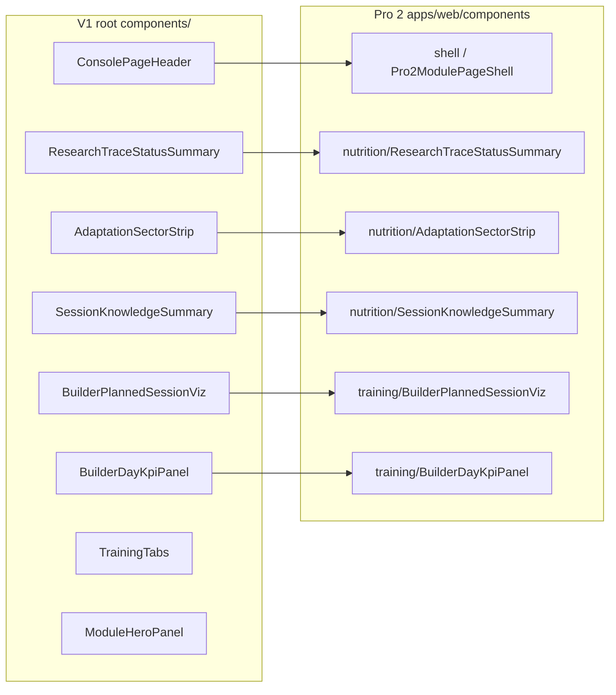

# Mappa importazione V1 (`nextjs-empathy-pro`) → Pro 2.0 (`empathy-pro-2-cursor`)

**Principio:** stessa intelligenza (lib, contratti serializzati, API); Pro 2 aggiunge shell grafica (`Pro2ModulePageShell`), subnav a pillole, e vincoli Pro 2 (`pro2-session-contract`, superfici generative). L’import non duplica motori: **porta UI/wiring e CSS** dove mancano.

**Sorgente V1:** `C:\Users\rovam\OneDrive\Documenti\EMPATHY\nextjs-empathy-pro`  
**Destinazione Pro 2:** `C:\Users\rovam\OneDrive\Documenti\EMPATHY\empathy-pro-2-cursor\apps\web`

---

## Livello 0 — Contratti e payload serializzati

| Artefatto V1 | Pro 2 | Nota |
|--------------|-------|------|
| `BUILDER_SESSION_JSON::` in `planned.notes` | Stesso tag in Pro 2 | `pro2-session-contract.ts` + `pro2-session-notes.ts` |
| `BuilderSessionContract` (V1) | `Pro2BuilderSessionContract` | Stesso ruolo; tipi allineati (blocchi, `chart`, `renderProfile`) |
| API `/api/training/*`, `/api/nutrition/*` | Route sotto `apps/web/app/api/` | Allineare handler se la risposta diverge |

---

## Livello 1 — `lib/` (motori e helper)

**Regola:** se il file esiste in Pro 2 con stesso nome, fare **diff** prima di sovrascrivere; la maggior parte della nutrizione è già allineata.

| Area V1 (`lib/…`) | Pro 2 (`apps/web/lib/…`) | Stato tipico |
|-------------------|--------------------------|--------------|
| `lib/nutrition/*` (meal plan, pathway, FDC helpers) | Parità o copia se mancante | Verificare file-per-file |
| `lib/training/builder/session-contract.ts` | `pro2-session-contract.ts` | Tipi equivalenti; UI Pro 2 usa Pro2 |
| `lib/training/engine/*` | Presente in Pro 2 | Diff su richiesta |
| `lib/memory/*`, `knowledge/*` | Presente / parziale | Estendere se endpoint V1 espone di più |

---

## Livello 2 — Componenti root V1 → Pro 2

V1 usa `@/components/*` (root repo). Pro 2 usa `@/components/{module}/*`.

| Componente V1 | Destinazione Pro 2 | Stato |
|-----------------|-------------------|--------|
| `ConsolePageHeader` | Sostituito da `Pro2ModulePageShell` (title/eyebrow) | Non copia 1:1 |
| `ModuleHeroPanel` | Opzionale: hero per modulo | Da valutare per training |
| `ResearchTraceStatusSummary` | `components/nutrition/ResearchTraceStatusSummary.tsx` | ✅ |
| `ResearchTraceScientificPanel` | `components/training/ResearchTraceScientificPanel.tsx` | ✅ (Tailwind Pro 2 + audit copy) |
| `AdaptationSectorStrip` | `components/nutrition/AdaptationSectorStrip.tsx` | ✅ |
| `SessionKnowledgeSummary` | `components/nutrition/SessionKnowledgeSummary.tsx` | ✅ |
| `BuilderPlannedSessionViz` | `components/training/BuilderPlannedSessionViz.tsx` | ✅ (tipo Pro2) |
| `BuilderDayKpiPanel` | `components/training/BuilderDayKpiPanel.tsx` | ✅ |
| `SessionMultilevelAnalysisStrip` | `components/training/SessionMultilevelAnalysisStrip.tsx` + `lib/training/session-multilevel-analysis-strip.ts` | ✅ (`Pro2SessionMultilevelSource`, target ipertrofia/neuro Pro 2) |
| `TrainingTabs` | `TrainingSubnav` + route Pro 2 | Parità funzionale diversa |
| `GymExerciseCards`, `ExerciseMediaThumb` | `GymExerciseMediaThumb`, composer Pro 2 | Parziale |
| `ReplicateStatusStrip` | `components/training/ReplicateStatusStrip.tsx` | ✅ + `GET /api/training/builder/replicate-status` |

---

## Livello 3 — Viste modulo (`apps/web/modules`)

| Modulo | V1 view | Pro 2 view | Azione import |
|--------|---------|------------|---------------|
| Nutrition | `NutritionPageView.tsx` (monolite + tab) | `NutritionPageView.tsx` + `NutritionMealPlanView.tsx` | Logica V1 già spezzata in `NutritionMealPlanWorkspace` / `LeadPanels`; diff residui |
| Training builder | `TrainingBuilderPageView.tsx` | `TrainingBuilderRichPageView.tsx` | Portare pezzi V1 (trace, replicate, cataloghi) solo se mancanti |
| Training session | `TrainingSessionPageView.tsx` (ricco) | `TrainingSessionPageView.tsx` (finestra) | **KPI giornata + viz blocchi** da V1 (questa serie) |
| Training calendar | `TrainingCalendarPageView.tsx` | `TrainingCalendarPageView.tsx` | Aggiungere `BuilderPlannedSessionViz` compact dove c’è contratto |
| Virya | `TrainingViryaPageView.tsx` | `TrainingViryaPageView.tsx` | Diff |
| Altri | dashboard, profile, … | `components/shell/*` | Allineamento incrementale |

---

## Livello 4 — CSS globale

Classi V1 usate da builder viz / KPI: `.builder-chart-*`, `.builder-kpi-grid`, `.builder-kpi-card`, `.viz-title`, `.kpi-card-label`.  
In Pro 2: aggiunte in `apps/web/app/globals.css` (blocco “V1 builder viz parity”).

---

## Ordine di esecuzione (checklist)

1. ✅ Documentare mappa (questo file).
2. ✅ `parsePro2BuilderSessionFromNotes`: accettare `source === "virya"` oltre `"builder"`.
3. ✅ `BuilderDayKpiPanel`, `BuilderPlannedSessionViz` (tipo `Pro2BuilderSessionContract`) + CSS in `globals.css`.
4. ✅ `TrainingSessionPageView`: KPI giornata aggregati dai primi 2 `planned` con `BUILDER_SESSION_JSON` in `notes`.
5. ✅ `CalendarPlannedBuilderDetail`: `BuilderPlannedSessionViz` compact (si mostra solo se ogni blocco ha `chart` + `renderProfile`, come V1).
6. ✅ Calendario mensile Pro 2: usa già `CalendarPlannedBuilderDetail` per cella giorno → eredita la viz.
7. ✅ `SessionMultilevelAnalysisStrip` + `session-multilevel-analysis-strip.ts` (tipi già in `api/training/contracts`); wiring in `CalendarPlannedBuilderDetail`; `parsePro2BuilderSessionFromNotes` → `Pro2SessionMultilevelSource`.
8. ⏳ Completion coach, hero session (parità `TrainingSessionPageView` V1). **Twin/recovery in UI:** card «Twin e recovery» + link Profile nell’header; **dati live** da athlete memory / twin API quando portati da V1.
9. ⏳ Builder V1 ↔ `TrainingBuilderRichPageView`: replicate strip, research panel, fetch nutrizione contesto.
10. ✅ Deploy Vercel monorepo: `apps/web/vercel.json` + `experimental.outputFileTracingRoot` in `next.config.mjs`; build prod OK (`StravaStyleMap` tipi Leaflet, no eslint rule fantasma).
11. ✅ Auth client API: `lib/auth/client-auth.ts` usa sessione `createBrowserClient` (Bearer) — fix 401 su `/api/nutrition/module` e altre route `requireRequestAthleteAccess`.

---

## Stato moduli (import uno alla volta)

| # | Modulo | Stato | Note |
|---|--------|--------|------|
| 1 | **Training · sessione + dettaglio pianificato** | ✅ batch 1 | KPI giornata, grafico zone builder, CSS, parser `virya`. |
| 2 | **Training · builder ricco** | 🟡 in corso | Sezione “contesto generativo”: `ResearchTraceScientificPanel`, `ReplicateStatusStrip`, sintesi nutrizione on-demand (`plannedDate`). |
| 3 | **Training · sessione profonda** | 🟡 | Strip multilivello ✅ in dettaglio pianificato; completion / hero V1 ⏳. |
| 4 | **Nutrition** | ⏳ | `NutritionMealPlanView` / `LeadPanels` già allineati a buona parte; diff residuo su export/micronutrienti. |
| 5 | **Profile** | ✅ batch Pro 2 | Route `/profile`, `GET/POST/PUT /api/profile`, `ProfilePageView` + shell/KPI canone, `coerceProfileViewModel`, twin + coverage. |
| 6 | **Physiology** | ✅ import batch | Route `(shell)/physiology`, `PhysiologyPageView` + motori (`engines/`, `lib/engines/`), API `GET/POST` physiology (+ history/profile/snapshot), PubMed `GET /api/knowledge/pubmed`, pannello lactate Pro 2. Shell ancora header V1-compat (`ConsolePageHeader` / `ModuleHeroPanel` shim) — opzionale migrazione a `Pro2ModulePageShell`. |
| 7 | **Health & Bio** | ✅ batch UI + API | Route `(shell)/health`, `HealthPageView` (`Pro2ModulePageShell`): import PDF 6 canali → `POST /api/health/upload-document` (`biomarker_panels`), `GET /api/health/panels-timeline` (Bearer), score globale, radial epigenetica (template), trend ematici (Recharts, demo se <2 punti reali), archivio. **Prossimi step:** parser PDF, storage file, radar infiammazione/microbiota come Figma. |

---

*Ultimo aggiornamento: Health & Bio Pro 2 (import, timeline, upload, grafici).*
